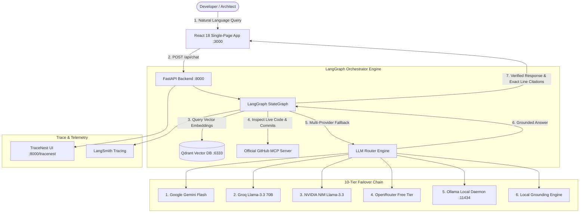

# RepoMind — AI Codebase Intelligence Platform

RepoMind is a modern, production-style AI assistant engineered to help software teams inspect, navigate, and deeply understand complex GitHub repositories with speed and cryptographic precision.

---

## 1. What is RepoMind? (In Plain Language)

Think of RepoMind as a dedicated senior engineer who has read every single line of code in your GitHub repository and remembers how everything connects.

Normally, when you ask a generic AI about a codebase, it guesses, hallucinates functions that do not exist, or asks you to copy-paste thousands of lines of code. RepoMind is fundamentally different:
- **It reads your code structurally**: Instead of cutting code in the middle of sentences or brackets, it understands classes, functions, and interfaces.
- **It searches with semantic memory**: It stores mathematical fingerprints (embeddings) of code snippets inside a high-speed vector search engine (Qdrant).
- **It talks directly to GitHub**: When you need to know about the latest commits or pull requests, it queries the official GitHub Model Context Protocol (MCP) server.
- **It never stops working**: If cloud AI services like Gemini, OpenAI, or Groq run out of tokens or experience rate limits, RepoMind automatically switches to backup AI models—including a completely free, local AI running on your machine via Ollama.
- **It provides exact proofs**: Every single answer includes the exact file names and line numbers so you can verify the truth immediately.

---

## 2. End-to-End System Architecture

![RepoMind End-to-End System Architecture](https://mermaid.ink/svg/Zmxvd2NoYXJ0IFRECiAgICBVc2VyKFtEZXZlbG9wZXIgLyBBcmNoaXRlY3RdKSAtLT58MS4gTmF0dXJhbCBMYW5ndWFnZSBRdWVyeXwgVUlbUmVhY3QgMTggU2luZ2xlLVBhZ2UgQXBwIDozMDAwXQogICAgVUkgLS0+fDIuIFBPU1QgL2FwaS9jaGF0fCBBUElbRmFzdEFQSSBCYWNrZW5kIDo4MDAwXQogICAgCiAgICBzdWJncmFwaCBDb3JlIFtMYW5nR3JhcGggT3JjaGVzdHJhdG9yIEVuZ2luZV0KICAgICAgICBBUEkgLS0+IEdyYXBoW0xhbmdHcmFwaCBTdGF0ZUdyYXBoXQogICAgICAgIEdyYXBoIC0tPnwzLiBRdWVyeSBWZWN0b3IgRW1iZWRkaW5nc3wgUWRyYW50WyhRZHJhbnQgVmVjdG9yIERCIDo2MzMzKV0KICAgICAgICBHcmFwaCAtLT58NC4gSW5zcGVjdCBMaXZlIENvZGUgJiBDb21taXRzfCBHaXRIdWJNQ1BbT2ZmaWNpYWwgR2l0SHViIE1DUCBTZXJ2ZXJdCiAgICAgICAgR3JhcGggLS0+fDUuIE11bHRpLVByb3ZpZGVyIEZhbGxiYWNrfCBMTE1Sb3V0ZXJbTExNIFJvdXRlciBFbmdpbmVdCiAgICBlbmQKCiAgICBzdWJncmFwaCBQcm92aWRlcnMgWzEwLVRpZXIgRmFpbG92ZXIgQ2hhaW5dCiAgICAgICAgTExNUm91dGVyIC0tPiBHZW1pbmlbMS4gR29vZ2xlIEdlbWluaSBGbGFzaF0KICAgICAgICBMTE1Sb3V0ZXIgLS0+IEdyb3FbMi4gR3JvcSBMbGFtYS0zLjMgNzBCXQogICAgICAgIExMTVJvdXRlciAtLT4gTnZpZGlhWzMuIE5WSURJQSBOSU0gTGxhbWEtMy4zXQogICAgICAgIExMTVJvdXRlciAtLT4gT3BlblJvdXRlcls0LiBPcGVuUm91dGVyIEZyZWUgVGllcl0KICAgICAgICBMTE1Sb3V0ZXIgLS0+IE9sbGFtYVs1LiBPbGxhbWEgTG9jYWwgRGFlbW9uIDoxMTQzNF0KICAgICAgICBMTE1Sb3V0ZXIgLS0+IExvY2FsRW5naW5lWzYuIExvY2FsIEdyb3VuZGluZyBFbmdpbmVdCiAgICBlbmQKCiAgICBzdWJncmFwaCBPYnNlcnZhYmlsaXR5IFtUcmFjZSAmIFRlbGVtZXRyeV0KICAgICAgICBBUEkgLS0+IFRyYWNlTmVzdFtUcmFjZU5lc3QgVUkgOjgwMDAvdHJhY2VuZXN0XQogICAgICAgIEdyYXBoIC0tPiBMYW5nU21pdGhbTGFuZ1NtaXRoIFRyYWNpbmddCiAgICBlbmQKCiAgICBMTE1Sb3V0ZXIgLS0+fDYuIEdyb3VuZGVkIEFuc3dlcnwgR3JhcGgKICAgIEdyYXBoIC0tPnw3LiBWZXJpZmllZCBSZXNwb25zZSAmIEV4YWN0IExpbmUgQ2l0YXRpb25zfCBVSQ==)



---

## 3. Technical Core Principles

RepoMind follows a **modular monolith** design pattern adhering strictly to engineering standards:
- **Zero Hallucinated Integrations**: Real external APIs, verified official package dependencies, and strict type checking.
- **Code-Aware Chunking**: AST-guided symbol extraction preserving module, class, function, and interface bounds with file path and line span tracking.
- **Resumable Indexing**: Background workers powered by Redis 7 and asynchronous Python tasks with individual file error boundaries.
- **10-Tier LLM Resilience**: Automatic failover across Gemini, Groq, NVIDIA NIM, OpenRouter, Mistral, DeepSeek, Moonshot/Kimi, OpenAI, and local Ollama.
- **TraceNest Telemetry**: Real-time request and AI execution telemetry served via an embedded dashboard at `http://localhost:8000/tracenest`.
- **Storybook Component Workbench**: Containerized Storybook 8 suite at `http://localhost:6006` showcasing 14 core UI components and 56 interactive states.

---

## 4. Docker-First Quickstart

Everything required by RepoMind runs inside Docker containers. Only **Docker** and **Docker Compose** are required on the host system.

### 4.1 Initialize Configuration
```bash
# Clone the repository
git clone https://github.com/your-org/repomind.git
cd repomind

# Initialize independent frontend and backend environment files
cp backend/.env.example backend/.env
cp frontend/.env.example frontend/.env
```

### 4.2 Start the Multi-Service Stack
```bash
docker compose up -d --build
```

### 4.3 Service Ports & Addresses
| Service | Local Address | Description |
| :--- | :--- | :--- |
| **Web Frontend** | [http://localhost:3000](http://localhost:3000) | React 18 Single-Page Application |
| **Storybook UI** | [http://localhost:6006](http://localhost:6006) | Component Design System & Stories |
| **Backend API** | [http://localhost:8000/docs](http://localhost:8000/docs) | FastAPI OpenAPI Documentation |
| **TraceNest Dashboard** | [http://localhost:8000/tracenest](http://localhost:8000/tracenest) | Observability & Telemetry UI |
| **Qdrant Vector DB** | [http://localhost:6333/dashboard](http://localhost:6333/dashboard) | Semantic Vector Search UI |
| **Ollama Local LLM** | [http://localhost:11434](http://localhost:11434) | Local Offline LLM Daemon |

---

## 5. Automated Verification & Testing

Verify the end-to-end integrity of all 9 running containers, vector retrieval, and telemetry:

```bash
# Run comprehensive live Docker integration pipeline
python backend/tests/test_live_docker.py

# Run backend unit test suite
pytest backend/tests -v
```

---

## 6. Complete Documentation Index

- [**System Architecture**](docs/architecture.md) — Architectural overview, layer responsibilities, and data flows.
- [**Configuration Guide**](docs/configuration.md) — Independent environment variables and secret hygiene.
- [**Development Workflow**](docs/development.md) — Local development, hot reloading, and toolchains.
- [**REST API Reference**](docs/api.md) — Complete endpoint schemas, parameters, and curl examples.
- [**Deployment Guide**](docs/deployment.md) — Single-node Docker and distributed cloud hosting.
- [**Testing & Quality**](docs/testing.md) — Pytest, Storybook tests, TypeScript strict checks, and CI.
- [**Troubleshooting Guide**](docs/troubleshooting.md) — Solutions for common issues and diagnostics.
- [**Security Architecture**](docs/security.md) — Credential protection, secret scrubbing, and safe indexing.
- [**Observability Guide**](docs/observability.md) — TraceNest dashboard, LangSmith tracing, and telemetry.
- [**Frontend Architecture**](docs/frontend.md) — React 18, TanStack Query, Tailwind CSS, and Zod forms.
- [**Storybook Catalog**](docs/storybook.md) — UI component library, controls, and states.
- [**Data Model & Storage**](docs/data-model.md) — PostgreSQL relational schema and Qdrant vector payloads.
- [**Feature Deep Dives**](docs/feature/):
  - [Code Chunking](docs/feature/code-chunking.md)
  - [Embeddings](docs/feature/embeddings.md)
  - [Execution Tracing](docs/feature/execution-trace.md)
  - [GitHub MCP](docs/feature/github-mcp.md)
  - [LLM Routing](docs/feature/llm-routing.md)
  - [RAG Chat](docs/feature/rag-chat.md)
  - [Repository Indexing](docs/feature/repository-indexing.md)

---

## 7. Community, Security & Policies

RepoMind is built with an uncompromising commitment to security, code confidentiality, and open-source collaboration:

- [**Contributing Guide**](CONTRIBUTING.md) — Workflow, code standards, Docker testing, and pull request procedures.
- [**Code of Conduct**](CODE_OF_CONDUCT.md) — Contributor Covenant v2.1 pledge and community standards.
- [**Security Policy**](SECURITY.md) — Vulnerability reporting, response SLAs, threat modeling, and secret handling.
- [**Privacy Policy**](PRIVACY.md) — Data protection, zero source code telemetry, local air-gapped deployment guarantees, and retention rules.

---

## 8. License

RepoMind is open-source software licensed under the [**Apache License, Version 2.0**](LICENSE).

```text
Copyright 2026 RepoMind Authors and Contributors

Licensed under the Apache License, Version 2.0 (the "License");
you may not use this file except in compliance with the License.
You may obtain a copy of the License at

    http://www.apache.org/licenses/LICENSE-2.0

Unless required by applicable law or agreed to in writing, software
distributed under the License is distributed on an "AS IS" BASIS,
WITHOUT WARRANTIES OR CONDITIONS OF ANY KIND, either express or implied.
See the License for the specific language governing permissions and
limitations under the License.
```

