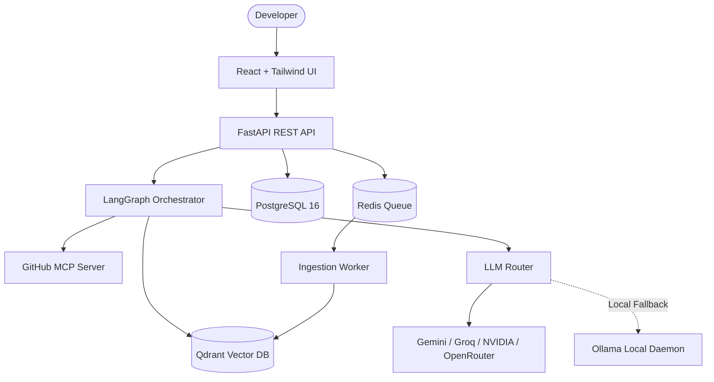

# RepoMind — AI Codebase Intelligence POC

RepoMind is a small, professional, end-to-end AI-powered application that helps developers understand and interrogate GitHub repositories with precision. It combines AST-aware code chunking, vector retrieval in Qdrant, live repository inspection via the official GitHub MCP server, LangGraph orchestration, task-aware multi-provider LLM routing, and full execution telemetry.

---

## Why RepoMind Exists

Developers often struggle to navigate complex repositories, verify current architectural behaviors, and trace multi-provider AI tool calls. Generic RAG systems frequently fail because they slice code into arbitrary character windows without symbol context and cannot fall back when cloud model quotas are exhausted. RepoMind solves this by:
- Preserving class, method, function, and interface boundaries.
- Seamlessly falling back across cloud and local Ollama inference models.
- Conditionally invoking official GitHub MCP tools when live repository updates are required.
- Providing complete execution traces and exact line-numbered source references.

---

## Key Capabilities

- **Code-Aware Parsing & Chunking**: Preserves structural boundaries (classes, functions, interfaces, types) rather than naive fixed-character splitting.
- **Resumable Indexing**: Shallow clone ingestion with isolated error boundaries. One failing file does not corrupt the job.
- **Qdrant Dense Vector Search**: High-performance semantic retrieval with repository-level filtering and line range tracking.
- **Official GitHub MCP Integration**: Read-only `search_code` and `get_file_contents` tools directly inside Docker.
- **Multi-Provider LLM Router**: Automatic failover (Gemini → Groq → NVIDIA → OpenRouter → Ollama) with bounded retries.
- **Grounded Source Citations**: Distinguishes indexed source from live MCP source with file paths and line ranges.
- **Observability & Trace Inspector**: Best-effort TraceNest and LangSmith tracing with in-UI execution timeline inspector.
- **Storybook UI Library**: Interactive Storybook stories with controls for all reusable components.

---

## Technology Stack

- **Frontend**: React 18, TypeScript (Strict), Vite, Tailwind CSS, TanStack Query, React Hook Form, Zod, Storybook.
- **Backend**: Python 3.12, FastAPI, Pydantic v2, SQLAlchemy 2.0, Alembic, PostgreSQL 16.
- **AI & Vector DB**: LangGraph, Qdrant, EmbeddingRouter, LLMRouter, Ollama.
- **Tools & Protocols**: Official GitHub MCP (`ghcr.io/github/github-mcp-server`), Redis 7.
- **Observability**: TraceNest, LangSmith.
- **Infrastructure**: Docker & Docker Compose.

---

## Architecture Diagram



---

## How to Run with Docker

RepoMind is built with a **Docker-First** standard. Everything required runs inside Docker containers:

```bash
# 1. Clone repository
git clone https://github.com/your-org/repomind.git
cd repomind

# 2. Configure environments
cp backend/.env.example backend/.env
cp frontend/.env.example frontend/.env

# 3. Start all services (including Storybook)
docker compose up -d --build
```

Once started:
- **Web Application**: [http://localhost:3000](http://localhost:3000)
- **Storybook UI**: [http://localhost:6006](http://localhost:6006)
- **API Documentation**: [http://localhost:8000/docs](http://localhost:8000/docs)
- **Qdrant Dashboard**: [http://localhost:6333/dashboard](http://localhost:6333/dashboard)
- **Ollama**: [http://localhost:11434](http://localhost:11434)

---

## Environment Configuration

See `.env.example` for the complete list of variables. Minimum recommended configuration:

```env
POSTGRES_PASSWORD=postgres
QDRANT_HOST=qdrant
OLLAMA_BASE_URL=http://ollama:11434
# Optional API Keys (System falls back automatically if omitted):
GEMINI_API_KEY=
GROQ_API_KEY=
GITHUB_PERSONAL_ACCESS_TOKEN=
```

---

## Basic Usage

1. **Select or Add Repository**: Enter a GitHub repository URL (e.g. `https://github.com/tiangolo/fastapi`) in the UI.
2. **Trigger Indexing**: Click **"Re-Index Codebase"**. The background worker clones the branch, chunks source code, generates embeddings, and indexes vectors into Qdrant.
3. **Ask Questions**: Ask questions like:
   - *"What is the main architecture of this repository?"*
   - *"Where is authentication handled and what methods exist?"*
4. **Inspect Sources & Traces**: Click on cited sources to see exact line ranges, and open **"Inspect Trace"** to view real latency, model provider, and execution steps.

---

## Documentation Links

- [Architecture Specification](docs/architecture.md)
- [Local Development & Testing](docs/development.md)
- [Configuration Reference](docs/configuration.md)
- [Feature: Repository Indexing](docs/feature/repository-indexing.md)
- [Feature: Code-Aware Chunking](docs/feature/code-chunking.md)
- [Feature: Embedding Router](docs/feature/embeddings.md)
- [Feature: LLM Routing & Fallback](docs/feature/llm-routing.md)
- [Feature: Official GitHub MCP Integration](docs/feature/github-mcp.md)
- [Feature: LangGraph Codebase Orchestration](docs/feature/rag-chat.md)
- [Feature: Execution Trace Inspector](docs/feature/execution-trace.md)

---

## Limitations

- **Read-Only GitHub MCP**: This POC restricts GitHub MCP operations to read-only tools (`search_code`, `get_file_contents`) to prevent unintended remote modifications.
- **Repository Size Guard**: Files larger than 1 MB are automatically skipped during indexing to prevent memory exhaustion.
- **Local Fallback Mode**: When cloud API keys and Ollama are both offline, the local deterministic grounding adapter provides context extraction without generative conversational prose.
