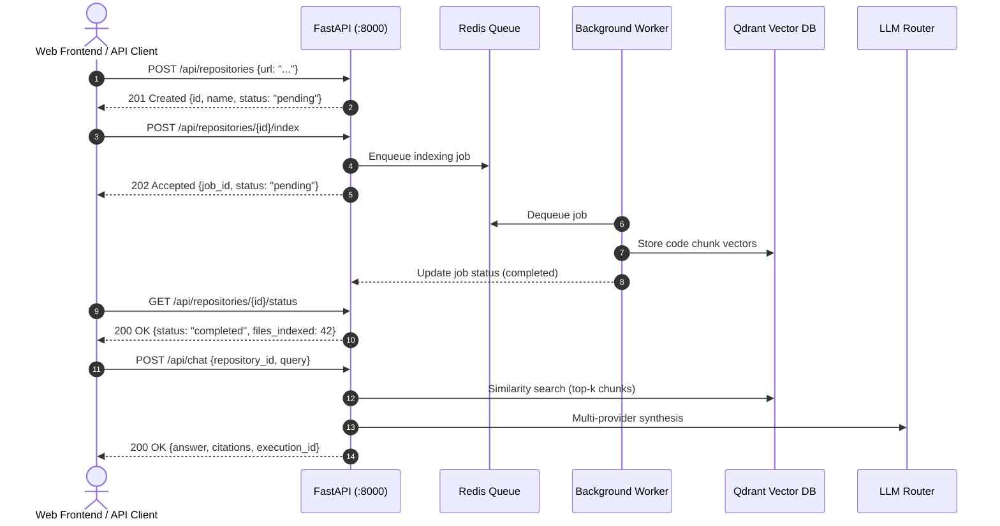

# RepoMind — REST API Specification

## 1. Overview (In Plain Language)

The RepoMind API allows any website, script, or mobile app to communicate with RepoMind. 

It provides standard web endpoints (URLs) to:
1. Register a GitHub repository.
2. Trigger the automated indexing of that repository.
3. Check the progress of the indexing job.
4. Send questions and receive detailed, grounded answers with code citations.
5. Inspect execution traces to see which AI models and search tools were used.

---

## 2. API Request-Response Lifecycle

![API Request-Response Lifecycle and Interactions](https://mermaid.ink/svg/c2VxdWVuY2VEaWFncmFtCiAgICBhdXRvbnVtYmVyCiAgICBhY3RvciBDbGllbnQgYXMgV2ViIEZyb250ZW5kIC8gQVBJIENsaWVudAogICAgcGFydGljaXBhbnQgQVBJIGFzIEZhc3RBUEkgKDo4MDAwKQogICAgcGFydGljaXBhbnQgUmVkaXMgYXMgUmVkaXMgUXVldWUKICAgIHBhcnRpY2lwYW50IFdvcmtlciBhcyBCYWNrZ3JvdW5kIFdvcmtlcgogICAgcGFydGljaXBhbnQgUWRyYW50IGFzIFFkcmFudCBWZWN0b3IgREIKICAgIHBhcnRpY2lwYW50IExMTSBhcyBMTE0gUm91dGVyCgogICAgQ2xpZW50LT4+QVBJOiBQT1NUIC9hcGkvcmVwb3NpdG9yaWVzIHt1cmw6ICIuLi4ifQogICAgQVBJLS0+PkNsaWVudDogMjAxIENyZWF0ZWQge2lkLCBuYW1lLCBzdGF0dXM6ICJwZW5kaW5nIn0KCiAgICBDbGllbnQtPj5BUEk6IFBPU1QgL2FwaS9yZXBvc2l0b3JpZXMve2lkfS9pbmRleAogICAgQVBJLT4+UmVkaXM6IEVucXVldWUgaW5kZXhpbmcgam9iCiAgICBBUEktLT4+Q2xpZW50OiAyMDIgQWNjZXB0ZWQge2pvYl9pZCwgc3RhdHVzOiAicGVuZGluZyJ9CgogICAgV29ya2VyLT4+UmVkaXM6IERlcXVldWUgam9iCiAgICBXb3JrZXItPj5RZHJhbnQ6IFN0b3JlIGNvZGUgY2h1bmsgdmVjdG9ycwogICAgV29ya2VyLS0+PkFQSTogVXBkYXRlIGpvYiBzdGF0dXMgKGNvbXBsZXRlZCkKCiAgICBDbGllbnQtPj5BUEk6IEdFVCAvYXBpL3JlcG9zaXRvcmllcy97aWR9L3N0YXR1cwogICAgQVBJLS0+PkNsaWVudDogMjAwIE9LIHtzdGF0dXM6ICJjb21wbGV0ZWQiLCBmaWxlc19pbmRleGVkOiA0Mn0KCiAgICBDbGllbnQtPj5BUEk6IFBPU1QgL2FwaS9jaGF0IHtyZXBvc2l0b3J5X2lkLCBxdWVyeX0KICAgIEFQSS0+PlFkcmFudDogU2ltaWxhcml0eSBzZWFyY2ggKHRvcC1rIGNodW5rcykKICAgIEFQSS0+PkxMTTogTXVsdGktcHJvdmlkZXIgc3ludGhlc2lzCiAgICBBUEktLT4+Q2xpZW50OiAyMDAgT0sge2Fuc3dlciwgY2l0YXRpb25zLCBleGVjdXRpb25faWR9)



---

## 3. Endpoints Reference

### 3.1 Health & Telemetry

#### `GET /health`
Returns the operational health of the FastAPI service and environment mode.
- **Response `200 OK`**:
  ```json
  {
    "status": "healthy",
    "service": "RepoMind API",
    "environment": "development"
  }
  ```

#### `GET /tracenest` & `GET /tracenest/`
Renders the interactive TraceNest telemetry dashboard displaying real-time execution logs, request latencies, and tool calls.

---

### 3.2 Repositories

#### `POST /api/repositories`
Registers a new GitHub repository for analysis.
- **Request Body**:
  ```json
  {
    "url": "https://github.com/octocat/Hello-World",
    "branch": "master"
  }
  ```
- **Response `201 Created`**:
  ```json
  {
    "id": "cbee282e-bad2-4603-b556-9256fddf1b2f",
    "name": "octocat/Hello-World",
    "url": "https://github.com/octocat/Hello-World",
    "branch": "master",
    "status": "pending",
    "created_at": "2026-09-21T18:00:00Z"
  }
  ```

#### `GET /api/repositories`
Lists all registered repositories.

#### `POST /api/repositories/{id}/index`
Triggers an asynchronous background indexing job for the specified repository.
- **Response `202 Accepted`**:
  ```json
  {
    "job_id": "8f8b3c10-5231-4ec1-a987-a2f019bca452",
    "repository_id": "cbee282e-bad2-4603-b556-9256fddf1b2f",
    "status": "pending"
  }
  ```

#### `GET /api/repositories/{id}/status`
Returns real-time progress of the indexing job.
- **Response `200 OK`**:
  ```json
  {
    "repository_id": "cbee282e-bad2-4603-b556-9256fddf1b2f",
    "status": "completed",
    "files_indexed": 12,
    "chunks_created": 48,
    "error": null
  }
  ```

---

### 3.3 Intelligence & Chat

#### `POST /api/chat`
Submits a natural language query against an indexed repository.
- **Request Body**:
  ```json
  {
    "repository_id": "cbee282e-bad2-4603-b556-9256fddf1b2f",
    "query": "How is the greeting printed and where is it located?"
  }
  ```
- **Response `200 OK`**:
  ```json
  {
    "message_id": "6fee9339-66f7-46b3-8eb4-6bf21a041477",
    "answer": "The greeting is stored in README and printed via standard output...",
    "citations": [
      {
        "file_path": "README",
        "symbol": "README",
        "start_line": 1,
        "end_line": 2,
        "source_type": "indexed"
      }
    ],
    "execution_id": "4697b851-4ccb-41c3-98c6-bdfa23f56b2d",
    "provider_used": "gemini",
    "model_used": "gemini-1.5-flash",
    "latency_ms": 1240
  }
  ```

#### `GET /api/executions/{id}`
Fetches the complete execution trace, including Qdrant retrieval metrics, GitHub MCP tool invocations, and LLM fallback chain attempts.
