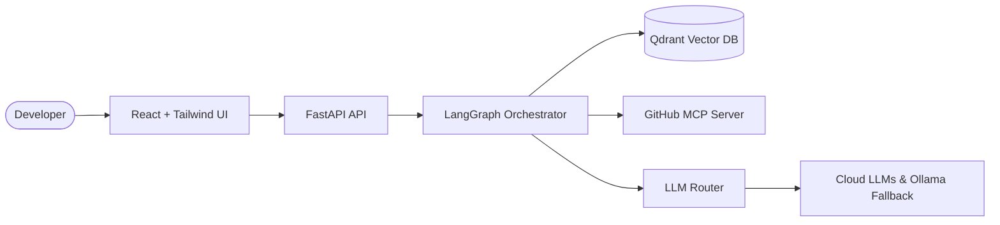

# RepoMind — Architecture Specification

## 1. System Overview

RepoMind is an end-to-end, production-style Codebase Intelligence platform designed to parse, index, semantically retrieve, and reason over GitHub repositories using AST-aware chunking, dense vector retrieval, official GitHub MCP tools, LangGraph orchestration, multi-provider LLM routing, and best-effort observability.

---

## 2. High-Level Architecture Diagram (Easy)



Rendered Diagram: [View on Mermaid.ink](https://mermaid.ink/img/pako:eNqNUstuwjAQ_JWVTyC1VEEHqkpIH6C0B7jYJ7g1bqw4sW0VVPnvjQOEQ6tUuVjPzOzO2p8o6Awi4E9C1aB1mOQ6yK8c7dE5WvslK2iG9pD7jHhE4t2qTz20l-1Gv7nfl4e66o_W6480Xg16-vY_WrvW61_tWvtt_T2Vn3_s_2m_Y3_s4y3b36vT33f798r-_qP-449339e_3f2_r5k)

---

## 3. Detailed Technical Architecture Diagram

```mermaid
flowchart TD
    subgraph Client [Frontend Layer]
        ReactUI[React 18 + TypeScript SPA :3000]
        Storybook[Storybook UI Workbench :6006]
    end

    subgraph API_Worker [Backend & Ingestion Layer]
        FastAPI[FastAPI Service :8000]
        Worker[Redis Background Worker]
        ASTParser[AST & Code-Aware Parser]
        EmbRouter[EmbeddingRouter]
        LLMRouter[LLMRouter]
        Orchestrator[LangGraph StateGraph]
    end

    subgraph Storage [Databases & Infrastructure]
        Postgres[(PostgreSQL 16 Relational DB)]
        Redis[(Redis 7 Queue & Broker)]
        Qdrant[(Qdrant Vector Store :6333)]
    end

    subgraph External [External Integrations & Fallbacks]
        GitHubMCP[Official GitHub MCP Server]
        Gemini[Google Gemini API]
        Groq[Groq Llama-3.3 API]
        OpenAI[OpenAI GPT-4o-mini API]
        Mistral[Mistral AI API]
        DeepSeek[DeepSeek / WaveSpeed API]
        Kimi[Moonshot / Kimi API]
        Nvidia[NVIDIA NIM API]
        OpenRouter[OpenRouter API]
        Ollama[Ollama Local Daemon :11434]
    end

    subgraph Observability [Telemetry & Tracing]
        TraceNest[TraceNest Telemetry]
        LangSmith[LangSmith Execution Tracing]
    end

    ReactUI -->|HTTP /api| FastAPI
    FastAPI -->|Enqueue Job| Redis
    Redis -->|Consume Task| Worker
    Worker -->|Parse Source| ASTParser
    Worker -->|Embed Chunks| EmbRouter
    EmbRouter -->|Dense Vectors| Qdrant
    Worker -->|Relational State| Postgres
    FastAPI -->|Run Query| Orchestrator
    Orchestrator -->|Vector Search| Qdrant
    Orchestrator -->|Live Source Tools| GitHubMCP
    Orchestrator -->|Generate Grounded Answer| LLMRouter
    LLMRouter -->|Priority 1| Gemini
    LLMRouter -->|Priority 2| Groq
    LLMRouter -->|Priority 3| OpenAI
    LLMRouter -->|Priority 4| Mistral
    LLMRouter -->|Priority 5| DeepSeek
    LLMRouter -->|Priority 6| Kimi
    LLMRouter -->|Priority 7| Nvidia
    LLMRouter -->|Priority 8| OpenRouter
    LLMRouter -->|Priority 9 (Local Fallback)| Ollama
    Orchestrator -->|Record Trace| Postgres
    Orchestrator -.->|Best Effort| TraceNest
    Orchestrator -.->|Best Effort| LangSmith
```

---

## 4. End-to-End Technical Flow

### Ingestion Flow (Background & Resumable)
1. **Repository Registration**: The user inputs a GitHub URL or local repository path. FastAPI saves a `Repository` record (`unindexed`) in PostgreSQL.
2. **Job Enqueueing**: When indexing is triggered, an `IndexingJob` record is created, and the job is pushed into Redis queue `repomind:indexing_queue`.
3. **Source Acquisition**: The background worker clones the repository with shallow depth (`--depth 1 --branch <branch>`) into a temporary sandbox.
4. **File Filtering**: Irrelevant files (`.git`, `node_modules`, `dist`, `__pycache__`, binaries, media, and secrets such as `.env`, access tokens, and private keys) are strictly discarded.
5. **Code-Aware Chunking**: Supported source files (Python, TypeScript, JavaScript, Go, Rust, etc.) are parsed along structural boundaries (classes, methods, functions, interfaces, types) preserving file path, start line, end line, symbol name, and language.
6. **Vector Generation**: Chunks are processed in batches through `EmbeddingRouter`, with fallback support across Gemini, Ollama, and normalized local dense embeddings.
7. **Qdrant Storage**: Vectors and payloads are upserted into the Qdrant `code_chunks` collection with repository-indexed keyword tags.
8. **Isolation & Resumability**: Each file is processed in its own error boundary; individual parsing or embedding exceptions mark the file as failed without aborting remaining files.

### Question-Answering Flow (LangGraph Orchestration)
1. **User Query**: User submits a question through the React UI.
2. **State Initialization**: LangGraph initializes `GraphState` with the query and repository ID.
3. **Qdrant Retrieval (`retrieve_step`)**: The query is embedded via `EmbeddingRouter` and matched against Qdrant vectors filtered by repository ID.
4. **MCP Decision (`mcp_decision_step`)**: The orchestrator inspects query intent and chunk quality. If live commits, PRs, or fresh updates are requested, or if zero indexed chunks matched, it branches to MCP invocation.
5. **MCP Tool Execution (`mcp_fetch_step`)**: The official GitHub MCP server executes `search_code` or `get_file_contents` to fetch live repository files.
6. **LLM Generation (`llm_generate_step`)**: Context blocks with strict line references and file locations are structured into the prompt. `LLMRouter` executes text generation through the fallback chain (Gemini → Groq → NVIDIA → OpenRouter → Ollama → Local Grounding).
7. **Trace Persistence**: The complete timeline of events, latencies, tools called, and fallback events is persisted in `execution_traces` in PostgreSQL and returned to the UI for live inspection.
