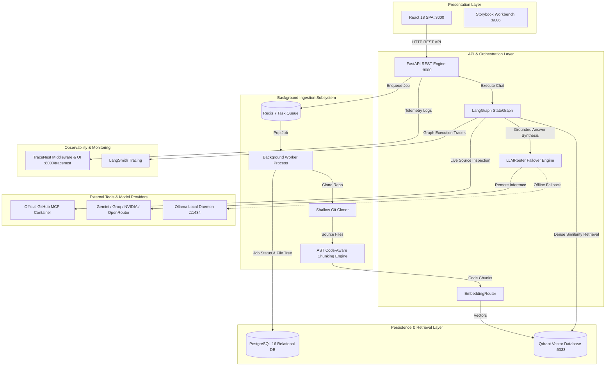

# RepoMind — System Architecture Specification

## 1. System Overview (In Plain Language)

RepoMind is built like an automated research library for software engineering projects.

When developers work with modern codebases consisting of hundreds or thousands of files, answering questions like *"How does error handling work in our database layer?"* requires finding and reading many interrelated files. RepoMind solves this in four logical stages:
1. **Cataloging (Ingestion)**: It clones the repository safely, discards binary and build files, and catalogs every source file.
2. **Reading (AST Chunking)**: Rather than slicing files into arbitrary character chunks that break code syntax, it uses the programming language's grammar rules to break the code into logical pieces (functions, classes, interfaces).
3. **Indexing (Vector Database)**: It converts these code snippets into mathematical vectors (embeddings) that capture the meaning of the code, storing them in Qdrant.
4. **Reasoning (LangGraph & Multi-Provider LLM)**: When you ask a question, RepoMind finds the relevant snippets in Qdrant, verifies recent changes directly on GitHub, and asks an AI model to answer. If the primary AI is unavailable, it automatically rolls over to backup models or a local AI.

---

## 2. Multi-Tier Architecture Diagram

![RepoMind Multi-Tier System Architecture](https://mermaid.ink/svg/Zmxvd2NoYXJ0IFRECiAgICBzdWJncmFwaCBQcmVzZW50YXRpb25MYXllciBbUHJlc2VudGF0aW9uIExheWVyXQogICAgICAgIFJlYWN0QXBwW1JlYWN0IDE4IFNQQSA6MzAwMF0KICAgICAgICBTdG9yeWJvb2tBcHBbU3Rvcnlib29rIFdvcmtiZW5jaCA6NjAwNl0KICAgIGVuZAoKICAgIHN1YmdyYXBoIFNlcnZpY2VMYXllciBbQVBJICYgT3JjaGVzdHJhdGlvbiBMYXllcl0KICAgICAgICBGYXN0QVBJU2VydmljZVtGYXN0QVBJIFJFU1QgRW5naW5lIDo4MDAwXQogICAgICAgIExhbmdHcmFwaE9yY2hlc3RyYXRvcltMYW5nR3JhcGggU3RhdGVHcmFwaF0KICAgICAgICBFbWJlZGRpbmdSb3V0ZXJTZXJ2aWNlW0VtYmVkZGluZ1JvdXRlcl0KICAgICAgICBMTE1Sb3V0ZXJTZXJ2aWNlW0xMTVJvdXRlciBGYWlsb3ZlciBFbmdpbmVdCiAgICBlbmQKCiAgICBzdWJncmFwaCBJbmdlc3Rpb25MYXllciBbQmFja2dyb3VuZCBJbmdlc3Rpb24gU3Vic3lzdGVtXQogICAgICAgIFJlZGlzQnJva2VyWyhSZWRpcyA3IFRhc2sgUXVldWUpXQogICAgICAgIEluZ2VzdGlvbldvcmtlcltCYWNrZ3JvdW5kIFdvcmtlciBQcm9jZXNzXQogICAgICAgIEdpdENsb25lcltTaGFsbG93IEdpdCBDbG9uZXJdCiAgICAgICAgQVNUUGFyc2VyW0FTVCBDb2RlLUF3YXJlIENodW5raW5nIEVuZ2luZV0KICAgIGVuZAoKICAgIHN1YmdyYXBoIFN0b3JhZ2VMYXllciBbUGVyc2lzdGVuY2UgJiBSZXRyaWV2YWwgTGF5ZXJdCiAgICAgICAgUG9zdGdyZXNEQlsoUG9zdGdyZVNRTCAxNiBSZWxhdGlvbmFsIERCKV0KICAgICAgICBRZHJhbnRTdG9yZVsoUWRyYW50IFZlY3RvciBEYXRhYmFzZSA6NjMzMyldCiAgICBlbmQKCiAgICBzdWJncmFwaCBFeHRlcm5hbExheWVyIFtFeHRlcm5hbCBUb29scyAmIE1vZGVsIFByb3ZpZGVyc10KICAgICAgICBHaXRIdWJNQ1BTZXJ2ZXJbT2ZmaWNpYWwgR2l0SHViIE1DUCBDb250YWluZXJdCiAgICAgICAgQ2xvdWRMTE1Qcm92aWRlcnNbR2VtaW5pIC8gR3JvcSAvIE5WSURJQSAvIE9wZW5Sb3V0ZXJdCiAgICAgICAgT2xsYW1hRGFlbW9uW09sbGFtYSBMb2NhbCBEYWVtb24gOjExNDM0XQogICAgZW5kCgogICAgc3ViZ3JhcGggVGVsZW1ldHJ5TGF5ZXIgW09ic2VydmFiaWxpdHkgJiBNb25pdG9yaW5nXQogICAgICAgIFRyYWNlTmVzdEVuZ2luZVtUcmFjZU5lc3QgTWlkZGxld2FyZSAmIFVJIDo4MDAwL3RyYWNlbmVzdF0KICAgICAgICBMYW5nU21pdGhFbmdpbmVbTGFuZ1NtaXRoIFRyYWNpbmddCiAgICBlbmQKCiAgICBSZWFjdEFwcCAtLT58SFRUUCBSRVNUIEFQSXwgRmFzdEFQSVNlcnZpY2UKICAgIEZhc3RBUElTZXJ2aWNlIC0tPnxFbnF1ZXVlIEpvYnwgUmVkaXNCcm9rZXIKICAgIFJlZGlzQnJva2VyIC0tPnxQb3AgSm9ifCBJbmdlc3Rpb25Xb3JrZXIKICAgIEluZ2VzdGlvbldvcmtlciAtLT58Q2xvbmUgUmVwb3wgR2l0Q2xvbmVyCiAgICBHaXRDbG9uZXIgLS0+fFNvdXJjZSBGaWxlc3wgQVNUUGFyc2VyCiAgICBBU1RQYXJzZXIgLS0+fENvZGUgQ2h1bmtzfCBFbWJlZGRpbmdSb3V0ZXJTZXJ2aWNlCiAgICBFbWJlZGRpbmdSb3V0ZXJTZXJ2aWNlIC0tPnxWZWN0b3JzfCBRZHJhbnRTdG9yZQogICAgSW5nZXN0aW9uV29ya2VyIC0tPnxKb2IgU3RhdHVzICYgRmlsZSBUcmVlfCBQb3N0Z3Jlc0RCCgogICAgRmFzdEFQSVNlcnZpY2UgLS0+fEV4ZWN1dGUgQ2hhdHwgTGFuZ0dyYXBoT3JjaGVzdHJhdG9yCiAgICBMYW5nR3JhcGhPcmNoZXN0cmF0b3IgLS0+fERlbnNlIFNpbWlsYXJpdHkgUmV0cmlldmFsfCBRZHJhbnRTdG9yZQogICAgTGFuZ0dyYXBoT3JjaGVzdHJhdG9yIC0tPnxMaXZlIFNvdXJjZSBJbnNwZWN0aW9ufCBHaXRIdWJNQ1BTZXJ2ZXIKICAgIExhbmdHcmFwaE9yY2hlc3RyYXRvciAtLT58R3JvdW5kZWQgQW5zd2VyIFN5bnRoZXNpc3wgTExNUm91dGVyU2VydmljZQogICAgTExNUm91dGVyU2VydmljZSAtLT58UmVtb3RlIEluZmVyZW5jZXwgQ2xvdWRMTE1Qcm92aWRlcnMKICAgIExMTVJvdXRlclNlcnZpY2UgLS4tPnxPZmZsaW5lIEZhbGxiYWNrfCBPbGxhbWFEYWVtb24KICAgIEZhc3RBUElTZXJ2aWNlIC0tPnxUZWxlbWV0cnkgTG9nc3wgVHJhY2VOZXN0RW5naW5lCiAgICBMYW5nR3JhcGhPcmNoZXN0cmF0b3IgLS0+fEdyYXBoIEV4ZWN1dGlvbiBUcmFjZXN8IExhbmdTbWl0aEVuZ2luZQ==)

---

## 3. Detailed Component Responsibilities

### 3.1 Presentation Layer
- **React 18 Single-Page Application (Port 3000)**: Built with TypeScript, Vite, and Tailwind CSS. Connects to the backend via TanStack Query for caching and real-time state synchronization.
- **Storybook UI Workbench (Port 6006)**: Independent development environment hosting isolated stories for all 14 reusable components across idle, loading, success, and error states.

### 3.2 Ingestion & Background Processing Subsystem
- **Redis 7 Broker**: Serves as the task queue for long-running indexing operations, isolating web requests from compute-heavy Git cloning and embedding generation.
- **Background Worker**: Python process executing `app.services.worker`. Clones Git repositories using shallow depth (`--depth 1`), filters ignored and sensitive paths, executes AST parsing, batches embedding generation, and records status in PostgreSQL.
- **Per-File Error Boundaries**: Failures during the parsing of one file do not abort the entire job. Unparseable files are recorded with descriptive errors while the remainder of the repository is fully indexed.

### 3.3 Storage Layer
- **PostgreSQL 16**: System of record for all relational data, including repository metadata, file trees, indexing job progression, chat threads, and execution telemetry traces.
- **Qdrant Vector Database**: Stores 384-dimensional dense vectors with cosine similarity metrics and payload metadata (`path`, `language`, `symbol`, `chunk_type`, `start_line`, `end_line`, `repository_id`).

### 3.4 Intelligence & AI Subsystem
- **LangGraph StateGraph**: Orchestrates the multi-stage query lifecycle:
  - Step 1: `qdrant_retrieval` (semantic vector search).
  - Step 2: `mcp_decision` (deterministic keyword and freshness heuristic).
  - Step 3: `mcp_execution` (optional live code query via GitHub MCP).
  - Step 4: `llm_routing_generation` (multi-provider resilient generation).
- **EmbeddingRouter**: Unified embedding manager with local sentence-transformers, Google Gemini, Ollama, and OpenAI fallbacks.
- **LLMRouter**: 10-tier cascading fallback router: Gemini → Groq → NVIDIA → OpenRouter → Mistral → DeepSeek → Kimi → OpenAI → Ollama → LocalGrounding.

### 3.5 Observability Layer
- **TraceNest**: Integrated logging framework providing automatic HTTP telemetry through `TraceNestMiddleware` and structured JSON logs visualized at `/tracenest/`.
- **LangSmith**: Best-effort LangGraph tracing for multi-step agent flows.
