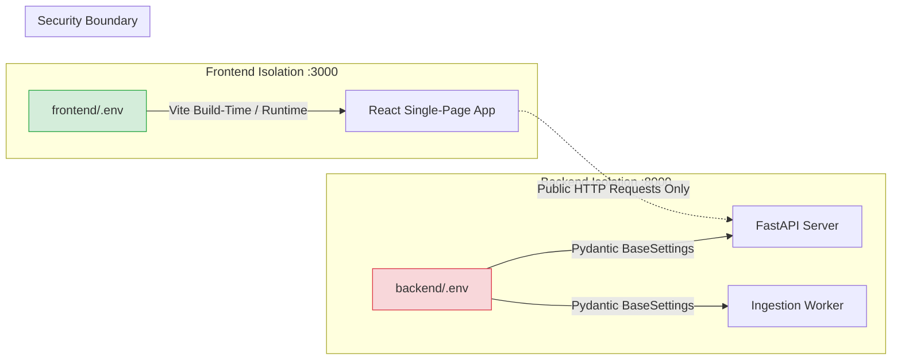

# RepoMind — Configuration & Environment Specification

## 1. Overview (In Plain Language)

RepoMind separates frontend and backend configuration completely.

Why?
- **Security**: The frontend runs in a user's web browser. Anyone can view the frontend's code. If database passwords or private AI keys were placed in the frontend configuration, anyone on the internet could steal them.
- **Independent Hosting**: The frontend can be hosted on platforms like Vercel or Cloudflare, while the backend runs in Docker or on AWS. Each system only knows what it strictly needs to function.

---

## 2. Configuration Isolation Architecture




---

## 3. Directory Layout

```text
RepoMind/
├── backend/
│   ├── .env                 # Private backend configuration & API keys (GITIGNORED)
│   ├── .env.example         # Template with placeholder descriptions
│   └── ...
├── frontend/
│   ├── .env                 # Browser-safe public variables (GITIGNORED)
│   ├── .env.example         # Template with placeholder descriptions
│   └── ...
├── docker-compose.yml       # Production-style multi-container orchestrator
└── .gitignore               # Enforces exclusion of all .env files
```

---

## 4. Frontend Variables (`frontend/.env`)

The frontend only consumes public variables starting with `VITE_`.

| Variable | Default | Purpose |
| :--- | :--- | :--- |
| `VITE_API_BASE_URL` | `http://localhost:8000` | Target URL for the RepoMind FastAPI backend. When deployed behind a reverse proxy, this can be left empty for relative `/api` paths. |
| `STORYBOOK_PORT` | `6006` | Port mapped to the Dockerized Storybook container (`repomind-storybook`). |

---

## 5. Backend Variables (`backend/.env`)

All private application settings, database credentials, vector database endpoints, and LLM API keys live exclusively in `backend/.env` and are loaded via Pydantic `BaseSettings`.

### Server & Infrastructure
| Variable | Default | Purpose |
| :--- | :--- | :--- |
| `ENVIRONMENT` | `development` | Runtime environment (`development`, `production`, `test`) |
| `LOG_LEVEL` | `INFO` | Logging verbosity (`DEBUG`, `INFO`, `WARNING`, `ERROR`) |
| `PORT` | `8000` | Port for FastAPI application |
| `CORS_ORIGINS` | `http://localhost:3000` | Allowed origins for web security headers |
| `DATABASE_URL` | `postgresql+asyncpg://...` | Async PostgreSQL connection string for API |
| `DATABASE_URL_SYNC` | `postgresql://...` | Sync PostgreSQL connection string for worker |
| `REDIS_URL` | `redis://redis:6379/0` | Redis queue and broker connection string |
| `QDRANT_HOST` | `qdrant` | Hostname of Qdrant vector database container |
| `QDRANT_PORT` | `6333` | Port for Qdrant REST and gRPC operations |

### LLM Providers & Fallback Chain
| Variable | Default | Purpose |
| :--- | :--- | :--- |
| `GEMINI_API_KEY` | `""` | Google Gemini API key (Primary tier) |
| `GEMINI_MODEL` | `gemini-1.5-flash` | Gemini model name |
| `GROQ_API_KEY` | `""` | Groq high-speed inference API key |
| `GROQ_MODEL` | `llama-3.3-70b-versatile` | Groq model name |
| `NVIDIA_API_KEY` | `""` | NVIDIA NIM API key |
| `NVIDIA_MODEL` | `meta/llama-3.3-70b-instruct` | NVIDIA NIM model name |
| `OPENROUTER_API_KEY` | `""` | OpenRouter multi-model gateway API key |
| `OLLAMA_BASE_URL` | `http://ollama:11434` | Ollama local inference endpoint (Offline fallback) |
| `OLLAMA_MODEL` | `deepseek-r1:1.5b` | Model installed in local Ollama daemon |

### GitHub MCP Integration
| Variable | Default | Purpose |
| :--- | :--- | :--- |
| `GITHUB_PERSONAL_ACCESS_TOKEN` | `""` | GitHub token for MCP live code retrieval |
| `GITHUB_MCP_SERVER_COMMAND` | `""` | Command or endpoint for MCP server |
