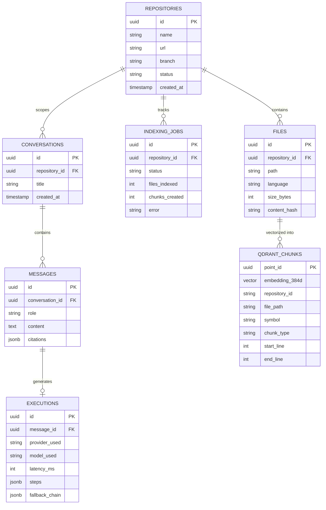

# RepoMind — Data Model & Storage Architecture

## 1. Overview (In Plain Language)

RepoMind stores data across two specialized database systems:
1. **PostgreSQL (The Filing Cabinet)**: Remembers your project details, chat history, indexing job statuses, and execution traces.
2. **Qdrant (The Semantic Search Engine)**: Stores mathematical vectors representing code snippets, allowing RepoMind to find relevant code by meaning rather than simple keyword matches.

---

## 2. Entity-Relationship & Vector Schema Diagram

![RepoMind Relational ERD and Vector Payload Schema](https://mermaid.ink/svg/ZXJEaWFncmFtCiAgICBSRVBPU0lUT1JJRVMgfHwtLW97IEZJTEVTIDogY29udGFpbnMKICAgIFJFUE9TSVRPUklFUyB8fC0tb3sgSU5ERVhJTkdfSk9CUyA6IHRyYWNrcwogICAgUkVQT1NJVE9SSUVTIHx8LS1veyBDT05WRVJTQVRJT05TIDogc2NvcGVzCiAgICBDT05WRVJTQVRJT05TIHx8LS1veyBNRVNTQUdFUyA6IGNvbnRhaW5zCiAgICBNRVNTQUdFUyB8fC0tb3wgRVhFQ1VUSU9OUyA6IGdlbmVyYXRlcwogICAgRklMRVMgfHwtLW97IFFEUkFOVF9DSFVOS1MgOiAidmVjdG9yaXplZCBpbnRvIgoKICAgIFJFUE9TSVRPUklFUyB7CiAgICAgICAgdXVpZCBpZCBQSwogICAgICAgIHN0cmluZyBuYW1lCiAgICAgICAgc3RyaW5nIHVybAogICAgICAgIHN0cmluZyBicmFuY2gKICAgICAgICBzdHJpbmcgc3RhdHVzCiAgICAgICAgdGltZXN0YW1wIGNyZWF0ZWRfYXQKICAgIH0KCiAgICBGSUxFUyB7CiAgICAgICAgdXVpZCBpZCBQSwogICAgICAgIHV1aWQgcmVwb3NpdG9yeV9pZCBGSwogICAgICAgIHN0cmluZyBwYXRoCiAgICAgICAgc3RyaW5nIGxhbmd1YWdlCiAgICAgICAgaW50IHNpemVfYnl0ZXMKICAgICAgICBzdHJpbmcgY29udGVudF9oYXNoCiAgICB9CgogICAgSU5ERVhJTkdfSk9CUyB7CiAgICAgICAgdXVpZCBpZCBQSwogICAgICAgIHV1aWQgcmVwb3NpdG9yeV9pZCBGSwogICAgICAgIHN0cmluZyBzdGF0dXMKICAgICAgICBpbnQgZmlsZXNfaW5kZXhlZAogICAgICAgIGludCBjaHVua3NfY3JlYXRlZAogICAgICAgIHN0cmluZyBlcnJvcgogICAgfQoKICAgIENPTlZFUlNBVElPTlMgewogICAgICAgIHV1aWQgaWQgUEsKICAgICAgICB1dWlkIHJlcG9zaXRvcnlfaWQgRksKICAgICAgICBzdHJpbmcgdGl0bGUKICAgICAgICB0aW1lc3RhbXAgY3JlYXRlZF9hdAogICAgfQoKICAgIE1FU1NBR0VTIHsKICAgICAgICB1dWlkIGlkIFBLCiAgICAgICAgdXVpZCBjb252ZXJzYXRpb25faWQgRksKICAgICAgICBzdHJpbmcgcm9sZQogICAgICAgIHRleHQgY29udGVudAogICAgICAgIGpzb25iIGNpdGF0aW9ucwogICAgfQoKICAgIEVYRUNVVElPTlMgewogICAgICAgIHV1aWQgaWQgUEsKICAgICAgICB1dWlkIG1lc3NhZ2VfaWQgRksKICAgICAgICBzdHJpbmcgcHJvdmlkZXJfdXNlZAogICAgICAgIHN0cmluZyBtb2RlbF91c2VkCiAgICAgICAgaW50IGxhdGVuY3lfbXMKICAgICAgICBqc29uYiBzdGVwcwogICAgICAgIGpzb25iIGZhbGxiYWNrX2NoYWluCiAgICB9CgogICAgUURSQU5UX0NIVU5LUyB7CiAgICAgICAgdXVpZCBwb2ludF9pZCBQSwogICAgICAgIHZlY3RvciBlbWJlZGRpbmdfMzg0ZAogICAgICAgIHN0cmluZyByZXBvc2l0b3J5X2lkCiAgICAgICAgc3RyaW5nIGZpbGVfcGF0aAogICAgICAgIHN0cmluZyBzeW1ib2wKICAgICAgICBzdHJpbmcgY2h1bmtfdHlwZQogICAgICAgIGludCBzdGFydF9saW5lCiAgICAgICAgaW50IGVuZF9saW5lCiAgICB9)



---

## 3. Database Schemas

### 3.1 PostgreSQL Relational Tables (SQLAlchemy 2.0)
- **`repositories`**: Stores registered GitHub repositories, target branches, and current ingestion status.
- **`files`**: Catalogs repository file trees, programming languages, and SHA-256 content hashes.
- **`indexing_jobs`**: Records background worker job progression, file counts, and error messages.
- **`conversations`**: Thread grouping for user chat sessions scoped to specific repositories.
- **`messages`**: Individual user queries and assistant responses with grounded citations.
- **`executions`**: Complete telemetry snapshots capturing providers attempted, latencies, and tool calls.

### 3.2 Qdrant Vector Collection (`repomind_code_chunks`)
- **Metric**: Cosine similarity (`Distance.COSINE`).
- **Dimensions**: 384 dimensions (matching `all-MiniLM-L6-v2` dense embeddings).
- **Payload Metadata**:
  ```json
  {
    "repository_id": "cbee282e-bad2-4603-b556-9256fddf1b2f",
    "path": "app/services/indexer.py",
    "language": "python",
    "symbol": "CodeIndexer.index_repository",
    "chunk_type": "method",
    "start_line": 45,
    "end_line": 95,
    "content_hash": "a3f891b2c4e..."
  }
  ```
