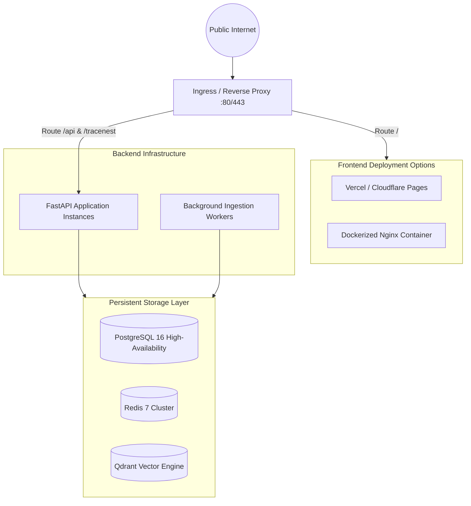

# RepoMind — Production Deployment Specification

## 1. Overview (In Plain Language)

Deploying RepoMind into production means taking it from your local computer and putting it onto a reliable cloud server so your whole team can use it anytime.

RepoMind supports two deployment models:
1. **Single-Node Docker Compose (Simplest)**: Everything runs together on one server (like an AWS EC2 instance, DigitalOcean Droplet, or Hetzner server).
2. **Distributed Cloud Architecture (Scalable)**: The frontend is hosted on a high-speed global content network (like Vercel or Cloudflare), while the backend API runs on a scalable container service (like AWS ECS, Google Cloud Run, or Render) backed by managed databases.

---

## 2. Production Topology Diagram

![RepoMind Production Topology Diagram](https://mermaid.ink/svg/Zmxvd2NoYXJ0IFRECiAgICBJbnRlcm5ldCgoUHVibGljIEludGVybmV0KSkgLS0+IEluZ3Jlc3NbSW5ncmVzcyAvIFJldmVyc2UgUHJveHkgOjgwLzQ0M10KICAgIAogICAgc3ViZ3JhcGggRnJvbnRlbmRIb3N0aW5nIFtGcm9udGVuZCBEZXBsb3ltZW50IE9wdGlvbnNdCiAgICAgICAgVmVyY2VsW1ZlcmNlbCAvIENsb3VkZmxhcmUgUGFnZXNdCiAgICAgICAgTmdpbnhTdGF0aWNbRG9ja2VyaXplZCBOZ2lueCBDb250YWluZXJdCiAgICBlbmQKCiAgICBzdWJncmFwaCBCYWNrZW5kQ2x1c3RlciBbQmFja2VuZCBJbmZyYXN0cnVjdHVyZV0KICAgICAgICBGYXN0QVBJQ2x1c3RlcltGYXN0QVBJIEFwcGxpY2F0aW9uIEluc3RhbmNlc10KICAgICAgICBXb3JrZXJDbHVzdGVyW0JhY2tncm91bmQgSW5nZXN0aW9uIFdvcmtlcnNdCiAgICBlbmQKCiAgICBzdWJncmFwaCBNYW5hZ2VkRGF0YSBbUGVyc2lzdGVudCBTdG9yYWdlIExheWVyXQogICAgICAgIFBvc3RncmVzWyhQb3N0Z3JlU1FMIDE2IEhpZ2gtQXZhaWxhYmlsaXR5KV0KICAgICAgICBSZWRpc1soUmVkaXMgNyBDbHVzdGVyKV0KICAgICAgICBRZHJhbnRbKFFkcmFudCBWZWN0b3IgRW5naW5lKV0KICAgIGVuZAoKICAgIEluZ3Jlc3MgLS0+fFJvdXRlIC8gfCBGcm9udGVuZEhvc3RpbmcKICAgIEluZ3Jlc3MgLS0+fFJvdXRlIC9hcGkgJiAvdHJhY2VuZXN0IHwgRmFzdEFQSUNsdXN0ZXIKICAgIEZhc3RBUElDbHVzdGVyIC0tPiBNYW5hZ2VkRGF0YQogICAgV29ya2VyQ2x1c3RlciAtLT4gTWFuYWdlZERhdGE=)



---

## 3. Deployment Models

### 3.1 Model A: Single-Node Docker Compose (Recommended for POC)
Deploy all 9 services directly using Docker Compose behind an Nginx reverse proxy providing automatic SSL/TLS termination:

```bash
# 1. Clone on production host
git clone https://github.com/your-org/repomind.git /opt/repomind
cd /opt/repomind

# 2. Configure production environments
cp backend/.env.example backend/.env
cp frontend/.env.example frontend/.env

# Edit backend/.env with production credentials and keys
# Set ENVIRONMENT=production and LOG_LEVEL=WARNING

# 3. Boot with restart policies
docker compose -f docker-compose.yml up -d --build
```

### 3.2 Model B: Distributed Hosting
- **Frontend SPA**: Built as static HTML/JS/CSS via `npm run build` and hosted on Vercel or Cloudflare Pages.
  - Set `VITE_API_BASE_URL=https://api.yourdomain.com`.
- **Backend API & Workers**: Containerized Docker image deployed to AWS ECS, Render, or Fly.io.
  - Set `CORS_ORIGINS=https://app.yourdomain.com`.
- **Databases**: Managed PostgreSQL (AWS RDS or Supabase) and Qdrant Cloud.
