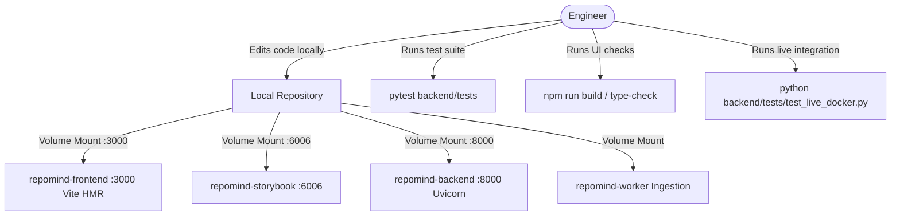

# RepoMind — Development Workflow Guide

## 1. Overview (In Plain Language)

Developing on RepoMind is built to be fast, reliable, and painless. 

You don't need to install PostgreSQL, Redis, Qdrant, or Ollama directly onto your computer. Docker runs all of these services in isolated containers, while volume mounts allow you to edit code in your local editor (like VS Code or Cursor) and see changes immediately without restarting containers.

---

## 2. Developer Inner Loop Diagram




---

## 3. Quickstart for Developers

### 3.1 Initial Environment Setup
```bash
git clone https://github.com/your-org/repomind.git
cd repomind

cp backend/.env.example backend/.env
cp frontend/.env.example frontend/.env
```

### 3.2 Starting the Full Stack
```bash
docker compose up -d --build
```
This boots all 9 containers with live volume mounts:
- Editing files in `frontend/src/` triggers instant Vite Hot Module Replacement (HMR) at `http://localhost:3000`.
- Editing stories in `frontend/src/stories/` reflects instantly in Storybook at `http://localhost:6006`.
- Editing files in `backend/app/` is mounted directly into `repomind-backend` and `repomind-worker`.

---

## 4. Running Tests & Quality Checks

### 4.1 Backend Pytest Suite
```bash
# Inside local Python environment or backend container
pytest backend/tests -v
```

### 4.2 End-to-End Live Docker Pipeline
```bash
# Executes complete repository creation, indexing, Qdrant retrieval, MCP, and chat
python backend/tests/test_live_docker.py
```

### 4.3 Frontend TypeScript & Lint Checks
```bash
cd frontend
npm run build
```

---

## 5. Working with Storybook

RepoMind uses Storybook as a first-class citizen for UI development. Every reusable component must maintain interactive stories covering idle, loading, success, and error states.

- Access Storybook: [http://localhost:6006](http://localhost:6006)
- Test Storybook build:
  ```bash
  cd frontend
  npm run build-storybook
  ```
