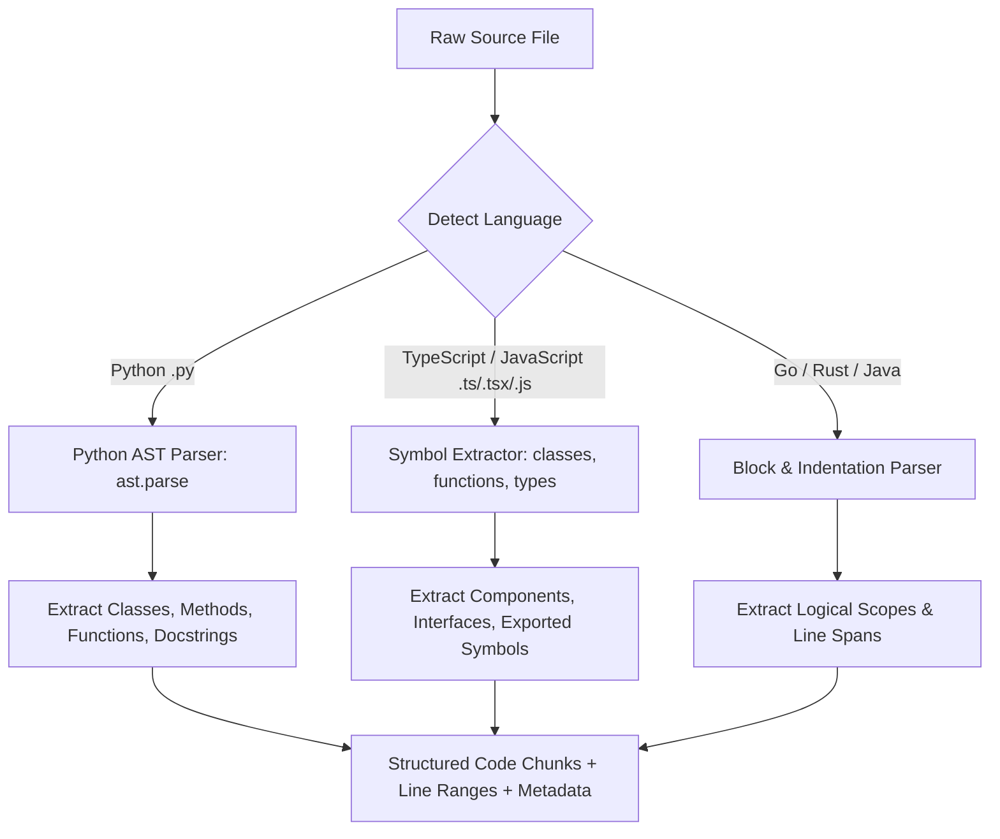

# Feature: Code-Aware Semantic Chunking

## 1. Overview (In Plain Language)

When standard search engines or simple AI tools read code, they often treat code like ordinary prose, cutting it into arbitrary 1,000-character blocks. This is disastrous for code because a function header might end up in one chunk while the function body ends up in another, destroying the logic.

RepoMind uses **Code-Aware Semantic Chunking**:
- It reads the code using the programming language's actual grammar rules.
- It identifies complete logical units—such as an entire Python class, a React component, or a TypeScript interface.
- It tracks the exact line numbers (e.g. lines 45 to 82) so you can always locate the exact source code.

---

## 2. Code Chunking Pipeline Diagram




---

## 3. Technical Architecture & Implementation

### 3.1 Python Abstract Syntax Tree (AST) Parsing
For Python files, RepoMind uses Python's standard `ast` module:
- Parses `ast.ClassDef`, `ast.FunctionDef`, and `ast.AsyncFunctionDef`.
- Preserves method hierarchy (`ClassName.method_name`).
- Extracts module-level docstrings as distinct architectural overview chunks.
- Preserves original indentation and exact 1-indexed `start_line` and `end_line`.

### 3.2 TypeScript / JavaScript Parsing
For JavaScript and TypeScript files:
- Detects `interface`, `type`, `class`, `export function`, and `React.FC` components.
- Scopes function boundaries using brace balancing and regex symbol detection.

### 3.3 Chunk Payload Metadata Schema
Every chunk emitted by the parser is enriched with metadata before vectorization:
```json
{
  "path": "app/services/orchestrator.py",
  "language": "python",
  "symbol": "LangGraphOrchestrator.run",
  "chunk_type": "method",
  "start_line": 142,
  "end_line": 188,
  "repository_id": "cbee282e-bad2-4603-b556-9256fddf1b2f"
}
```
