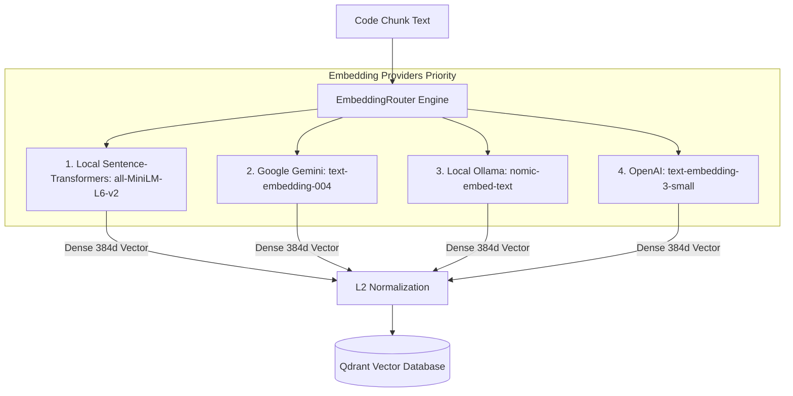

# Feature: Multi-Provider Embedding Router

## 1. Overview (In Plain Language)

An "embedding" is a mathematical summary of a piece of code. It converts words and symbols into a list of numbers (a vector) so that a computer can calculate how closely related two ideas are.

For example, an embedding engine knows that `def authenticate_user():` is closely related to the question *"How do users log in?"*, even though the exact words are different.

RepoMind includes an **EmbeddingRouter** that:
- Automatically uses an ultra-fast, local model (`all-MiniLM-L6-v2`) that requires no external API keys.
- Falls back to cloud providers like Google Gemini or OpenAI if configured.
- Guarantees vectors are compatible with our Qdrant vector database.

---

## 2. Embedding Generation Flow Diagram

---

## 3. Technical Architecture

### 3.1 Responsibilities
- **Dimensional Uniformity**: Enforces a standard 384-dimensional vector format for seamless indexing in Qdrant collection `repomind_code_chunks`.
- **Batch Processing**: Groups code chunks into batches of 32 to maximize throughput and minimize CPU/GPU overhead.
- **Provider Resilience**: If a remote embedding provider times out or returns HTTP 429, the router automatically fails over to the local fallback without crashing the indexing worker.

### 3.2 Supported Providers
1. **Local (Default)**: Embedded fast transformer (`all-MiniLM-L6-v2`) running directly in the Python runtime.
2. **Google Gemini**: `text-embedding-004` via Google Generative AI REST API.
3. **Ollama**: `nomic-embed-text` served via Dockerized Ollama daemon.
4. **OpenAI**: `text-embedding-3-small` via OpenAI API.
