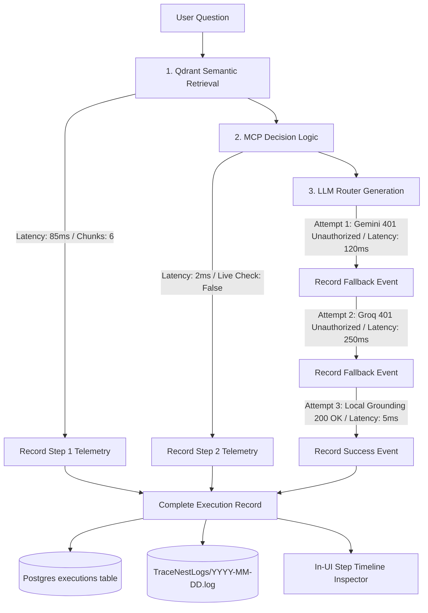

# Feature: In-UI Execution Trace & Timeline Inspector

## 1. Overview (In Plain Language)

AI systems should never be a black box. When RepoMind gives you an answer, you have the right to know exactly how that answer was generated:
- *What code files were retrieved from the database?*
- *Did the AI make a live call to GitHub to verify recent changes?*
- *Did Gemini fail and fall back to local Ollama?*
- *How many milliseconds did each step take?*

RepoMind's **Execution Trace Inspector** displays an interactive timeline right inside the chat window so you can inspect every single step and fallback event.

---

## 2. Execution Telemetry Pipeline Diagram

![Execution Telemetry Capture and Visualization](https://mermaid.ink/svg/Zmxvd2NoYXJ0IFRECiAgICBVc2VyUXVlcnlbVXNlciBRdWVzdGlvbl0gLS0+IFN0ZXAxWzEuIFFkcmFudCBTZW1hbnRpYyBSZXRyaWV2YWxdCiAgICBTdGVwMSAtLT58TGF0ZW5jeTogODVtcyAvIENodW5rczogNnwgVHJhY2VSZWMxW1JlY29yZCBTdGVwIDEgVGVsZW1ldHJ5XQogICAgCiAgICBTdGVwMSAtLT4gU3RlcDJbMi4gTUNQIERlY2lzaW9uIExvZ2ljXQogICAgU3RlcDIgLS0+fExhdGVuY3k6IDJtcyAvIExpdmUgQ2hlY2s6IEZhbHNlfCBUcmFjZVJlYzJbUmVjb3JkIFN0ZXAgMiBUZWxlbWV0cnldCiAgICAKICAgIFN0ZXAyIC0tPiBTdGVwM1szLiBMTE0gUm91dGVyIEdlbmVyYXRpb25dCiAgICBTdGVwMyAtLT58QXR0ZW1wdCAxOiBHZW1pbmkgNDAxIFVuYXV0aG9yaXplZCAvIExhdGVuY3k6IDEyMG1zfCBGYWxsYmFjazFbUmVjb3JkIEZhbGxiYWNrIEV2ZW50XQogICAgRmFsbGJhY2sxIC0tPnxBdHRlbXB0IDI6IEdyb3EgNDAxIFVuYXV0aG9yaXplZCAvIExhdGVuY3k6IDI1MG1zfCBGYWxsYmFjazJbUmVjb3JkIEZhbGxiYWNrIEV2ZW50XQogICAgRmFsbGJhY2syIC0tPnxBdHRlbXB0IDM6IExvY2FsIEdyb3VuZGluZyAyMDAgT0sgLyBMYXRlbmN5OiA1bXN8IEZhbGxiYWNrU3VjY2Vzc1tSZWNvcmQgU3VjY2VzcyBFdmVudF0KICAgIAogICAgVHJhY2VSZWMxIC0tPiBBZ2dyZWdhdGVbQ29tcGxldGUgRXhlY3V0aW9uIFJlY29yZF0KICAgIFRyYWNlUmVjMiAtLT4gQWdncmVnYXRlCiAgICBGYWxsYmFja1N1Y2Nlc3MgLS0+IEFnZ3JlZ2F0ZQogICAgCiAgICBBZ2dyZWdhdGUgLS0+IFNhdmVEQlsoUG9zdGdyZXMgZXhlY3V0aW9ucyB0YWJsZSldCiAgICBBZ2dyZWdhdGUgLS0+IFNhdmVUTlsoVHJhY2VOZXN0TG9ncy9ZWVlZLU1NLURELmxvZyldCiAgICBBZ2dyZWdhdGUgLS0+IFVJSW5zcGVjdG9yW0luLVVJIFN0ZXAgVGltZWxpbmUgSW5zcGVjdG9yXQ==)



---

## 3. Technical Implementation

### 3.1 Trace Data Model
Every user question produces an immutable `Execution` record linked to the response message:
```json
{
  "id": "4697b851-4ccb-41c3-98c6-bdfa23f56b2d",
  "message_id": "6fee9339-66f7-46b3-8eb4-6bf21a041477",
  "provider_used": "local_grounding",
  "model_used": "heuristic-v1",
  "latency_ms": 6182,
  "steps": [
    {
      "name": "qdrant_retrieval",
      "status": "success",
      "latency_ms": 85,
      "details": {"chunks_found": 6, "embedding_provider": "local"}
    },
    {
      "name": "mcp_decision",
      "status": "success",
      "latency_ms": 2,
      "details": {"triggered": false, "reason": "Indexed context sufficient"}
    },
    {
      "name": "llm_routing_generation",
      "status": "success",
      "latency_ms": 6095,
      "details": {"providers_attempted": 10, "fallback_occurred": true}
    }
  ]
}
```

### 3.2 Dual Sink Persistence
1. **PostgreSQL**: Saved relationally in table `executions` for real-time frontend querying (`GET /api/executions/:id`).
2. **TraceNest Logs**: Serialized to structured JSON logs at `/app/TraceNestLogs/YYYY-MM-DD.log` for debugging via the TraceNest UI at `http://localhost:8000/tracenest/`.
