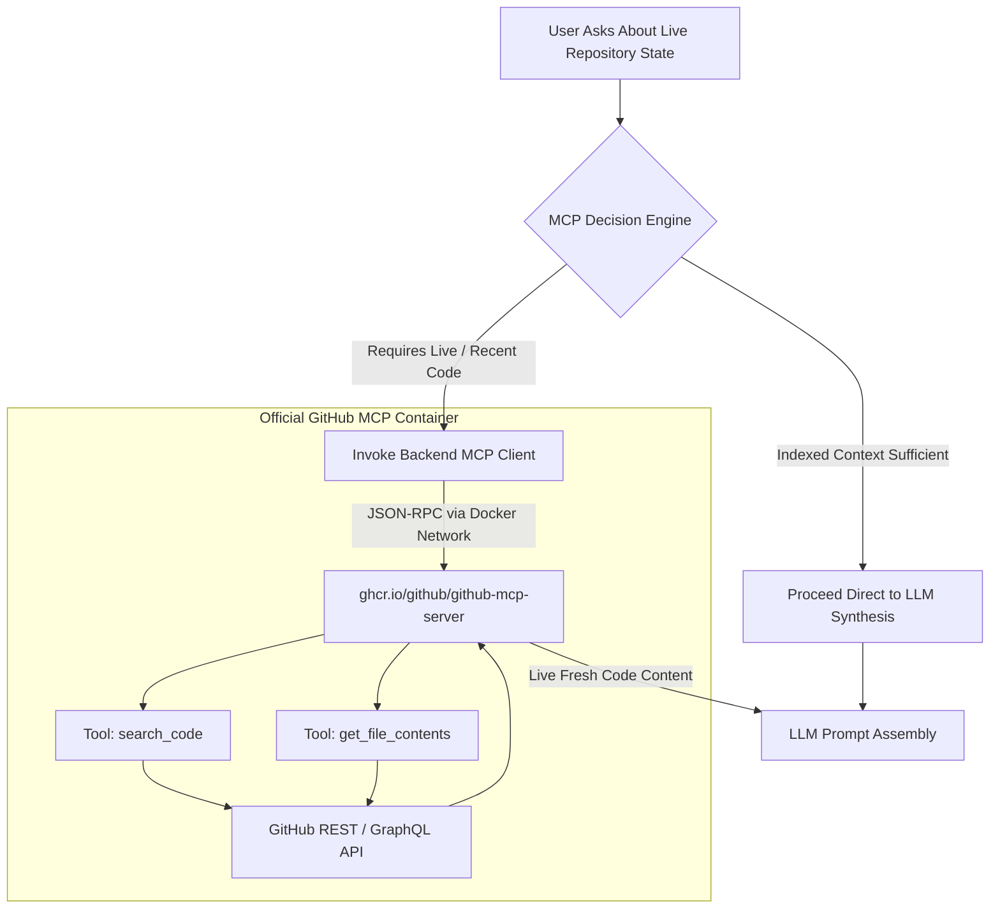

# Feature: Official GitHub MCP Integration

## 1. Overview (In Plain Language)

Codebases change constantly. If you indexed your repository yesterday, but an engineer pushed a bugfix this morning, an AI relying solely on indexed data might give an outdated answer.

RepoMind solves this using the **Model Context Protocol (MCP)**:
- RepoMind runs the official, secure GitHub MCP server in a Docker container.
- When a user asks about *"the latest commits"* or *"current changes"*, RepoMind queries GitHub live to inspect fresh files.
- It clearly tags citations as **Live Source** vs **Indexed Source** so you always know what data you are reading.

---

## 2. GitHub MCP Interaction Flow Diagram

![Official GitHub MCP Server Integration](https://mermaid.ink/svg/Zmxvd2NoYXJ0IFRECiAgICBRdWVyeVtVc2VyIEFza3MgQWJvdXQgTGl2ZSBSZXBvc2l0b3J5IFN0YXRlXSAtLT4gRGVjaXNpb257TUNQIERlY2lzaW9uIEVuZ2luZX0KICAgIAogICAgRGVjaXNpb24gLS0+fEluZGV4ZWQgQ29udGV4dCBTdWZmaWNpZW50fCBTa2lwTUNQW1Byb2NlZWQgRGlyZWN0IHRvIExMTSBTeW50aGVzaXNdCiAgICBEZWNpc2lvbiAtLT58UmVxdWlyZXMgTGl2ZSAvIFJlY2VudCBDb2RlfCBDYWxsTUNQW0ludm9rZSBCYWNrZW5kIE1DUCBDbGllbnRdCiAgICAKICAgIHN1YmdyYXBoIERvY2tlck1DUCBbT2ZmaWNpYWwgR2l0SHViIE1DUCBDb250YWluZXJdCiAgICAgICAgQ2FsbE1DUCAtLT58SlNPTi1SUEMgdmlhIERvY2tlciBOZXR3b3JrfCBNQ1BTZXJ2ZXJbZ2hjci5pby9naXRodWIvZ2l0aHViLW1jcC1zZXJ2ZXJdCiAgICAgICAgTUNQU2VydmVyIC0tPiBUb29sU2VhcmNoW1Rvb2w6IHNlYXJjaF9jb2RlXQogICAgICAgIE1DUFNlcnZlciAtLT4gVG9vbENvbnRlbnRbVG9vbDogZ2V0X2ZpbGVfY29udGVudHNdCiAgICAgICAgVG9vbFNlYXJjaCAtLT4gR2l0SHViQVBJW0dpdEh1YiBSRVNUIC8gR3JhcGhRTCBBUEldCiAgICAgICAgVG9vbENvbnRlbnQgLS0+IEdpdEh1YkFQSQogICAgZW5kCgogICAgR2l0SHViQVBJIC0tPiBNQ1BTZXJ2ZXIKICAgIE1DUFNlcnZlciAtLT58TGl2ZSBGcmVzaCBDb2RlIENvbnRlbnR8IExMTUNvbnRleHRbTExNIFByb21wdCBBc3NlbWJseV0KICAgIFNraXBNQ1AgLS0+IExMTUNvbnRleHQ=)

---

## 3. Technical Details

### 3.1 Standard Containerization
RepoMind uses the official GitHub MCP server image (`ghcr.io/github/github-mcp-server`) running as service `github-mcp` in `docker-compose.yml`:
- Communicates via JSON-RPC protocol over standard container interfaces.
- Authenticates using `GITHUB_PERSONAL_ACCESS_TOKEN` defined in `backend/.env`.

### 3.2 Read-Only Safety Boundary
To guarantee repository safety:
- Only read-only tools (`search_code`, `get_file_contents`) are permitted.
- Write tools (commit, push, branch creation, delete) are prohibited.
- If MCP credentials are not supplied or hit rate limits, the system fails gracefully back to indexed RAG context.
