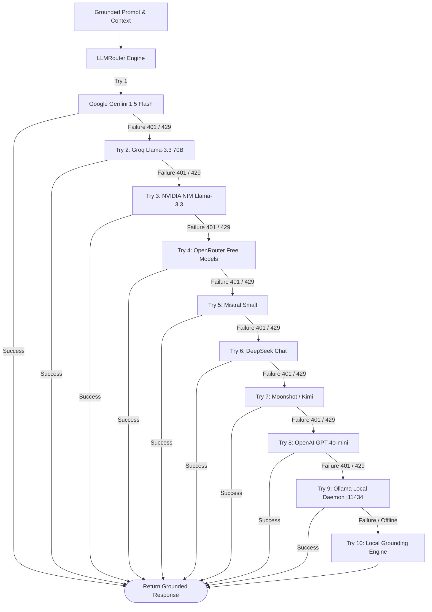

# Feature: 10-Tier Multi-Provider LLM Router

## 1. Overview (In Plain Language)

Cloud AI providers are notorious for unexpected downtime, rate limits (HTTP 429 errors), and quota expirations. If an application only connects to a single AI provider, your team is completely blocked when that provider experiences an outage.

RepoMind solves this with a **10-Tier LLM Router**:
- It attempts the fastest, most cost-effective cloud AI first.
- If that provider fails, it seamlessly tries the next provider in milliseconds.
- If the entire internet is down or all cloud API keys are empty, it falls back to a **local AI running inside Docker on your machine via Ollama**.
- If even Ollama is unavailable, RepoMind's **Local Grounding Engine** synthesizes the exact retrieved code chunks so you always receive an answer.

---

## 2. 10-Tier Failover State Machine Diagram

![10-Tier Multi-Provider Fallback State Machine](https://mermaid.ink/svg/Zmxvd2NoYXJ0IFRECiAgICBQcm9tcHRbR3JvdW5kZWQgUHJvbXB0ICYgQ29udGV4dF0gLS0+IFJvdXRlcltMTE1Sb3V0ZXIgRW5naW5lXQogICAgCiAgICBSb3V0ZXIgLS0+fFRyeSAxfCBHZW1pbmlbR29vZ2xlIEdlbWluaSAxLjUgRmxhc2hdCiAgICBHZW1pbmkgLS0+fFN1Y2Nlc3N8IENvbXBsZXRlKFtSZXR1cm4gR3JvdW5kZWQgUmVzcG9uc2VdKQogICAgR2VtaW5pIC0tPnxGYWlsdXJlIDQwMSAvIDQyOXwgR3JvcVtUcnkgMjogR3JvcSBMbGFtYS0zLjMgNzBCXQogICAgCiAgICBHcm9xIC0tPnxTdWNjZXNzfCBDb21wbGV0ZQogICAgR3JvcSAtLT58RmFpbHVyZSA0MDEgLyA0Mjl8IE52aWRpYVtUcnkgMzogTlZJRElBIE5JTSBMbGFtYS0zLjNdCiAgICAKICAgIE52aWRpYSAtLT58U3VjY2Vzc3wgQ29tcGxldGUKICAgIE52aWRpYSAtLT58RmFpbHVyZSA0MDEgLyA0Mjl8IE9wZW5Sb3V0ZXJbVHJ5IDQ6IE9wZW5Sb3V0ZXIgRnJlZSBNb2RlbHNdCiAgICAKICAgIE9wZW5Sb3V0ZXIgLS0+fFN1Y2Nlc3N8IENvbXBsZXRlCiAgICBPcGVuUm91dGVyIC0tPnxGYWlsdXJlIDQwMSAvIDQyOXwgTWlzdHJhbFtUcnkgNTogTWlzdHJhbCBTbWFsbF0KICAgIAogICAgTWlzdHJhbCAtLT58U3VjY2Vzc3wgQ29tcGxldGUKICAgIE1pc3RyYWwgLS0+fEZhaWx1cmUgNDAxIC8gNDI5fCBEZWVwU2Vla1tUcnkgNjogRGVlcFNlZWsgQ2hhdF0KICAgIAogICAgRGVlcFNlZWsgLS0+fFN1Y2Nlc3N8IENvbXBsZXRlCiAgICBEZWVwU2VlayAtLT58RmFpbHVyZSA0MDEgLyA0Mjl8IEtpbWlbVHJ5IDc6IE1vb25zaG90IC8gS2ltaV0KICAgIAogICAgS2ltaSAtLT58U3VjY2Vzc3wgQ29tcGxldGUKICAgIEtpbWkgLS0+fEZhaWx1cmUgNDAxIC8gNDI5fCBPcGVuQUlbVHJ5IDg6IE9wZW5BSSBHUFQtNG8tbWluaV0KICAgIAogICAgT3BlbkFJIC0tPnxTdWNjZXNzfCBDb21wbGV0ZQogICAgT3BlbkFJIC0tPnxGYWlsdXJlIDQwMSAvIDQyOXwgT2xsYW1hW1RyeSA5OiBPbGxhbWEgTG9jYWwgRGFlbW9uIDoxMTQzNF0KICAgIAogICAgT2xsYW1hIC0tPnxTdWNjZXNzfCBDb21wbGV0ZQogICAgT2xsYW1hIC0tPnxGYWlsdXJlIC8gT2ZmbGluZXwgTG9jYWxHcm91bmRbVHJ5IDEwOiBMb2NhbCBHcm91bmRpbmcgRW5naW5lXQogICAgTG9jYWxHcm91bmQgLS0+IENvbXBsZXRl)



---

## 3. Technical Architecture

### 3.1 Provider Adapter Pattern
All LLM providers implement a unified interface:
```python
class BaseLLMAdapter(ABC):
    @abstractmethod
    async def generate(
        self,
        prompt: str,
        system_prompt: Optional[str] = None,
        max_tokens: int = 1500,
        temperature: float = 0.2
    ) -> str:
        pass
```

### 3.2 10-Tier Sequence Order
1. **Google Gemini Flash**: Ultra-low latency, generous free tier.
2. **Groq**: High-throughput Llama-3.3 70B inference.
3. **NVIDIA NIM**: Enterprise-grade Llama-3.3 models.
4. **OpenRouter**: Aggregated multi-model gateway.
5. **Mistral AI**: Fast European inference models.
6. **DeepSeek**: High-performance reasoning models.
7. **Moonshot / Kimi**: Long-context reasoning.
8. **OpenAI**: GPT-4o-mini fallback.
9. **Ollama**: Local Docker daemon running offline models.
10. **Local Grounding Engine**: Heuristic deterministic code synthesizer.
