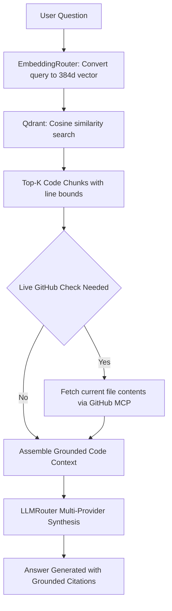

# Feature: Retrieval-Augmented Generation (RAG) Chat

## 1. Overview (In Plain Language)

Standard AI models only know what they were trained on in the past. They have no idea what code is inside your private repository today.

**Retrieval-Augmented Generation (RAG)** is the technique RepoMind uses to solve this:
1. When you ask a question, RepoMind searches your codebase for the most relevant functions and classes.
2. It gathers those specific code snippets and feeds them into the AI alongside your question.
3. The AI reads the actual code and answers based strictly on reality, citing exact file names and line numbers.

---

## 2. RAG Retrieval & Synthesis Pipeline Diagram




---

## 3. Technical Architecture

### 3.1 LangGraph Orchestrator
The RAG workflow is coordinated using a compiled LangGraph `StateGraph`:
- **Node `qdrant_retrieval`**: Embeds query vector and runs similarity retrieval filtered by `repository_id`.
- **Node `mcp_decision`**: Analyzes question keywords (e.g. "latest", "current", "fresh", "commit") and chunk freshness.
- **Node `mcp_execution`**: Invokes the official GitHub MCP server when live code verification is demanded.
- **Node `llm_routing_generation`**: Injects retrieved code into a strict system prompt instructing the model to cite exact line spans.

### 3.2 Grounded Citation Verification
Every response contains structured citation objects:
```json
{
  "file_path": "backend/app/main.py",
  "symbol": "app",
  "start_line": 35,
  "end_line": 56,
  "source_type": "indexed"
}
```
