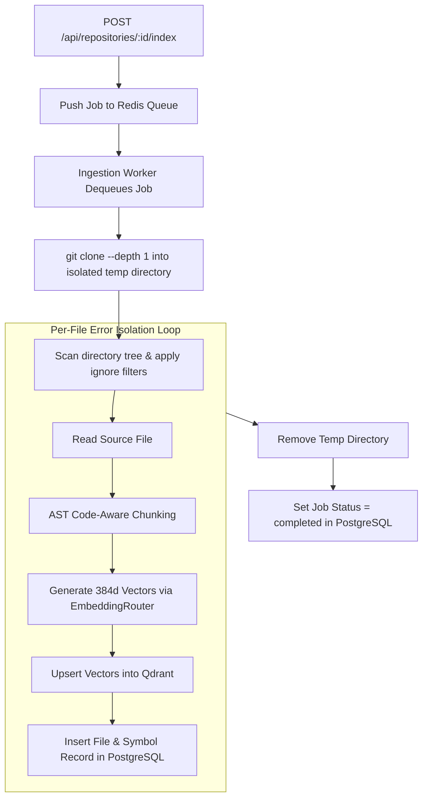

# Feature: Resumable Repository Indexing

## 1. Overview (In Plain Language)

Indexing a large software repository requires downloading files, parsing thousands of lines of code, and calculating mathematical embeddings. If you tried to do all of this during a single web request, your browser would freeze and time out.

RepoMind's **Repository Indexing Engine**:
- Runs in the background using Redis and a dedicated worker process.
- Processes files with **isolated error boundaries**: if a single corrupted file has a syntax error, RepoMind records the error for that file and keeps indexing the rest of the repository without stopping.
- Automatically ignores useless files like `node_modules/`, `.git/`, and `.env` secrets.

---

## 2. Background Ingestion Pipeline Diagram

![Resumable Background Indexing Workflow](https://mermaid.ink/svg/Zmxvd2NoYXJ0IFRECiAgICBSZWdpc3RlcltQT1NUIC9hcGkvcmVwb3NpdG9yaWVzLzppZC9pbmRleF0gLS0+IEVucXVldWVbUHVzaCBKb2IgdG8gUmVkaXMgUXVldWVdCiAgICBFbnF1ZXVlIC0tPiBXb3JrZXJbSW5nZXN0aW9uIFdvcmtlciBEZXF1ZXVlcyBKb2JdCiAgICAKICAgIFdvcmtlciAtLT4gU2hhbGxvd0Nsb25lW2dpdCBjbG9uZSAtLWRlcHRoIDEgaW50byBpc29sYXRlZCB0ZW1wIGRpcmVjdG9yeV0KICAgIFNoYWxsb3dDbG9uZSAtLT4gU2NhbkZpbGVzW1NjYW4gZGlyZWN0b3J5IHRyZWUgJiBhcHBseSBpZ25vcmUgZmlsdGVyc10KICAgIAogICAgc3ViZ3JhcGggRmlsZUxvb3AgW1Blci1GaWxlIEVycm9yIElzb2xhdGlvbiBMb29wXQogICAgICAgIFNjYW5GaWxlcyAtLT4gUmVhZEZpbGVbUmVhZCBTb3VyY2UgRmlsZV0KICAgICAgICBSZWFkRmlsZSAtLT4gQVNUUGFyc2VbQVNUIENvZGUtQXdhcmUgQ2h1bmtpbmddCiAgICAgICAgQVNUUGFyc2UgLS0+IEJhdGNoRW1iZWRbR2VuZXJhdGUgMzg0ZCBWZWN0b3JzIHZpYSBFbWJlZGRpbmdSb3V0ZXJdCiAgICAgICAgQmF0Y2hFbWJlZCAtLT4gU2F2ZVFkcmFudFtVcHNlcnQgVmVjdG9ycyBpbnRvIFFkcmFudF0KICAgICAgICBTYXZlUWRyYW50IC0tPiBTYXZlUG9zdGdyZXNbSW5zZXJ0IEZpbGUgJiBTeW1ib2wgUmVjb3JkIGluIFBvc3RncmVTUUxdCiAgICBlbmQKCiAgICBGaWxlTG9vcCAtLT4gQ2xlYW51cFtSZW1vdmUgVGVtcCBEaXJlY3RvcnldCiAgICBDbGVhbnVwIC0tPiBNYXJrQ29tcGxldGVbU2V0IEpvYiBTdGF0dXMgPSBjb21wbGV0ZWQgaW4gUG9zdGdyZVNRTF0=)

---

## 3. Technical Architecture

### 3.1 Ingestion Flow
1. **Trigger**: Client issues `POST /api/repositories/:id/index`. FastAPI creates an `indexing_jobs` row in PostgreSQL and pushes the job ID to Redis.
2. **Shallow Clone**: The worker performs a fast Git shallow clone (`git clone --depth 1`).
3. **Filtering**: The worker ignores build directories, binaries, and secrets.
4. **AST Chunking**: Source files are parsed into semantic chunks.
5. **Embedding & Storage**: Vectors are upserted to Qdrant, and relational metadata is written to PostgreSQL.
6. **Completion**: Temporary disk storage is purged, and the job status is set to `completed`.
