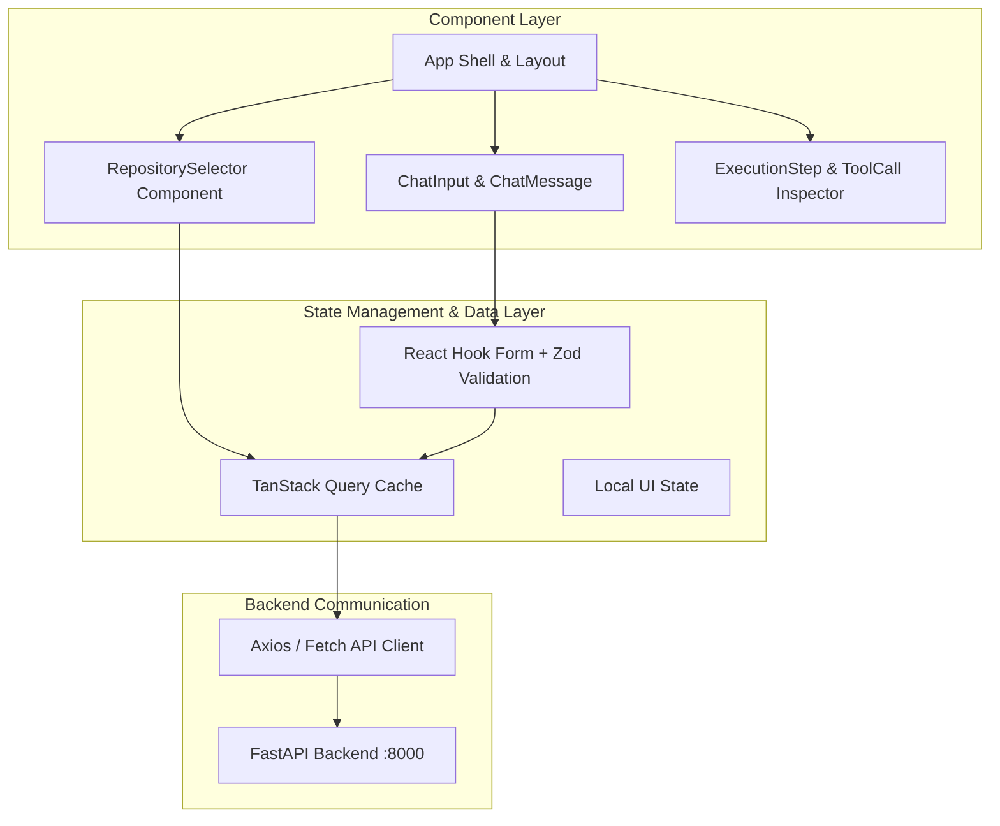

# RepoMind — Frontend Architecture Specification

## 1. Overview (In Plain Language)

The RepoMind frontend is a fast, responsive Single-Page Application (SPA) designed to feel like a modern developer workbench.

Instead of reloading the entire web page on every interaction:
- The app updates instantly when you select repositories or submit questions.
- It displays live progress indicators during indexing.
- It provides rich code snippet previews with exact line numbers and syntax formatting.
- It renders an interactive timeline showing the AI's step-by-step thinking process.

---

## 2. Frontend Component Hierarchy & State Flow

![Frontend Component Hierarchy and State Flow](https://mermaid.ink/svg/Zmxvd2NoYXJ0IFRECiAgICBzdWJncmFwaCBVSUNvbXBvbmVudHMgW0NvbXBvbmVudCBMYXllcl0KICAgICAgICBBcHBbQXBwIFNoZWxsICYgTGF5b3V0XQogICAgICAgIFJlcG9TZWxlY3RvcltSZXBvc2l0b3J5U2VsZWN0b3IgQ29tcG9uZW50XQogICAgICAgIENoYXRBcmVhW0NoYXRJbnB1dCAmIENoYXRNZXNzYWdlXQogICAgICAgIFRpbWVsaW5lW0V4ZWN1dGlvblN0ZXAgJiBUb29sQ2FsbCBJbnNwZWN0b3JdCiAgICBlbmQKCiAgICBzdWJncmFwaCBTdGF0ZUFuZERhdGEgW1N0YXRlIE1hbmFnZW1lbnQgJiBEYXRhIExheWVyXQogICAgICAgIFRhblN0YWNrW1RhblN0YWNrIFF1ZXJ5IENhY2hlXQogICAgICAgIFpvZEZvcm1zW1JlYWN0IEhvb2sgRm9ybSArIFpvZCBWYWxpZGF0aW9uXQogICAgICAgIExvY2FsU3RhdGVbTG9jYWwgVUkgU3RhdGVdCiAgICBlbmQKCiAgICBzdWJncmFwaCBSZW1vdGVBUEkgW0JhY2tlbmQgQ29tbXVuaWNhdGlvbl0KICAgICAgICBBcGlDbGllbnRbQXhpb3MgLyBGZXRjaCBBUEkgQ2xpZW50XQogICAgICAgIEJhY2tlbmRBUElbRmFzdEFQSSBCYWNrZW5kIDo4MDAwXQogICAgZW5kCgogICAgQXBwIC0tPiBSZXBvU2VsZWN0b3IKICAgIEFwcCAtLT4gQ2hhdEFyZWEKICAgIEFwcCAtLT4gVGltZWxpbmUKCiAgICBSZXBvU2VsZWN0b3IgLS0+IFRhblN0YWNrCiAgICBDaGF0QXJlYSAtLT4gWm9kRm9ybXMKICAgIFpvZEZvcm1zIC0tPiBUYW5TdGFjawogICAgVGFuU3RhY2sgLS0+IEFwaUNsaWVudAogICAgQXBpQ2xpZW50IC0tPiBCYWNrZW5kQVBJ)

---

## 3. Technical Architecture

### 3.1 Stack
- **Framework**: React 18 with Vite for lightning-fast Hot Module Replacement (HMR).
- **Type Safety**: Strict TypeScript (`noImplicitAny: true`, strict null checks).
- **Styling**: Tailwind CSS with custom utility composition and full dark/light theme support.
- **Server State**: TanStack Query (React Query) for querying, mutations, and caching.
- **Form Management**: React Hook Form with Zod schemas for runtime schema validation.

### 3.2 Key UI Components
- **`RepositorySelector`**: Controlled dropdown allowing quick switching between indexed repositories with status indicators.
- **`ChatInput` & `ChatMessage`**: Keyboard-accessible chat interface with Markdown rendering and code syntax highlighting.
- **`SourceCitation`**: Grounded citation pill displaying file path, symbol, line range, and source type (Indexed vs Live GitHub).
- **`ExecutionStep` & `ToolCall`**: Collapsible execution trace cards showing latency, tool arguments, and provider fallback status.
