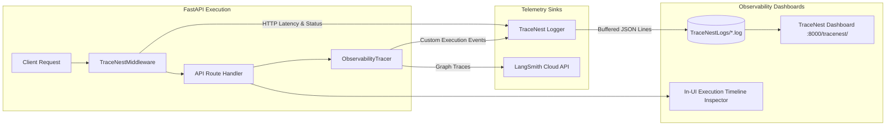

# RepoMind — Observability & Telemetry Specification

## 1. Overview (In Plain Language)

When an AI system operates behind the scenes, developers need to know:
- *Which AI model actually answered my question?*
- *Did the cloud provider fail and fall back to local Ollama?*
- *How long did the vector search in Qdrant take?*
- *What files were retrieved?*

RepoMind provides full transparency through an integrated observability stack:
1. **TraceNest Dashboard**: A built-in web dashboard at `http://localhost:8000/tracenest` showing real-time logs, response times, and system events.
2. **In-UI Execution Inspector**: An interactive step-by-step timeline inside the chat window showing every stage of processing.
3. **LangSmith Integration**: Deep distributed tracing for multi-step LangGraph agent workflows.

---

## 2. Telemetry Pipeline Diagram

---

## 3. Telemetry Systems Reference

### 3.1 TraceNest UI & Logging (`http://localhost:8000/tracenest`)
- **Location**: Hosted directly by FastAPI at `/tracenest/`.
- **Log Files**: Stored in `TraceNestLogs/YYYY-MM-DD.log` as structured, single-line JSON records.
- **Middleware**: `TraceNestMiddleware` automatically captures:
  - Client IP, HTTP method, and path.
  - Duration in milliseconds (`duration_ms`).
  - HTTP status codes and sanitized header maps.
- **Event Logging**: Ingestion milestones, Qdrant retrieval stats, and LLM fallback events are recorded via `ObservabilityTracer`.

### 3.2 In-UI Execution Timeline
Whenever a chat question is submitted, the API returns an `execution_id`. The frontend displays an interactive visual timeline showing:
- **`qdrant_retrieval`**: Chunks found, embedding provider used, latency in ms.
- **`mcp_decision`**: Deterministic decision on whether live repository inspection was triggered.
- **`llm_routing_generation`**: Every provider attempted, individual error messages (e.g. 401 Unauthorized or 429 Rate Limit), and the winning provider.

### 3.3 LangSmith Distributed Tracing
When `LANGSMITH_API_KEY` is configured in `backend/.env`, all LangGraph agent steps are mirrored to LangSmith. Telemetry failures are strictly non-fatal and will never crash the application.
