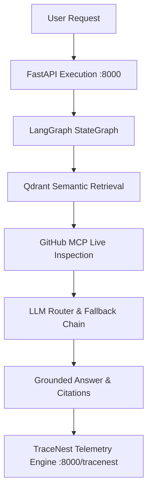

# RepoMind — Observability & Telemetry Specification

## 1. Overview (In Plain Language)

Observability means giving developers an X-ray view into how RepoMind functions under the hood.

When you ask a question like *"Where is user authentication implemented?"*, RepoMind triggers multiple coordinated systems:
1. It looks up your query in the **Qdrant vector database**.
2. It decides whether to fetch current code from **GitHub MCP**.
3. It tries cloud AI models like **Gemini** or **Groq**.
4. If rate limits or network issues occur, it rolls over to **Ollama** or **Local Grounding**.

In many systems, the logs would simply say:
`HTTP request completed`
`HTTP request completed`
`HTTP request completed`

This tells you nothing useful. In RepoMind, every important operation produces a **high-signal, descriptive event** that explains what happened, which component did it, how long it took, and whether any fallback occurred—all visible without opening raw JSON payloads.

---

## 2. Request & Telemetry Pipeline Diagram




---

## 3. High-Signal Event Architecture (No Generic Messages)

RepoMind completely eliminates uninformative `"HTTP request completed"` logs. 

Instead, HTTP requests are logged by `RepoMindHTTPTelemetryMiddleware` with meaningful operational context:
- `POST /api/repositories completed — repository registered`
- `POST /api/repositories/:id/index completed — indexing job queued`
- `GET /api/repositories/:id/status completed — indexing status checked`
- `POST /api/chat completed — intelligence response generated`
- `GET /api/executions/:id completed — execution trace retrieved`
- `POST /api/chat failed — LLM providers unavailable` (on error)

Furthermore, noise from polling endpoints (such as TraceNest UI log refreshes and health checks) is suppressed so that application logs remain 100% focused on real user actions.

---

## 4. Component Logger Taxonomy

TraceNest categorizes events into distinct `LOGGER` namespaces:

| Logger | System Responsibility | Example Message |
| :--- | :--- | :--- |
| `api` | FastAPI endpoints & HTTP request dispatch | `POST /api/chat completed — intelligence response generated` |
| `repository` | Repository registration and cataloging | `Repository registered successfully: octocat/Hello-World` |
| `indexer` | Background repository cloning & file crawling | `Repository indexing completed — 12 files, 48 chunks` |
| `parser` | AST code-aware parsing & symbol extraction | `Parsed and indexed 14 chunks from app/services/retriever.py` |
| `embedding` | Multi-provider vector embedding generation | `Generated 14 embeddings via 'local' in 12ms` |
| `qdrant` | Vector database upserting & search | `Stored 14 code chunks in Qdrant` |
| `retrieval` | Semantic similarity search for chat queries | `Retrieved 6 relevant code chunks from Qdrant` |
| `mcp` | Official GitHub Model Context Protocol tools | `Live GitHub source required — commit freshness check` |
| `llm` | Multi-provider LLM routing & fallback sequence | `gemini failed (unauthorized) — switching to groq` |
| `langgraph` | Multi-step agent state machine orchestration | `LangGraph execution finished — 6 grounded sources assembled` |
| `chat` | End-to-end chat response delivery | `Chat response completed — 6 sources cited (local_grounding)` |
| `observability` | Telemetry queries and trace persistence | `Execution trace retrieved for ID 87b2dc6d...` |

---

## 5. Event Levels & TraceNest Visual Badging

TraceNest visualizes log levels with color-coded badges:

- **`INFO`** *(Blue Badge)*: Normal, successful operations (e.g. chunks parsed, query answered, job completed).
- **`DEBUG`** *(Gray Badge)*: Diagnostic details for developers (e.g. batch size, internal search scores, provider selection).
- **`WARNING`** *(Yellow Badge)*: Fallbacks, skipped files, rate limits, recoverable degradation (e.g. `gemini failed (rate limited) — switching to groq`, `Skipped large file`).
- **`ERROR`** *(Red Badge)*: Non-recoverable failures (e.g. `Repository indexing failed: connection refused`).

---

## 6. Complete Event Catalog by Lifecycle

### 6.1 Repository Lifecycle
- `repository_registered` (`INFO`, logger: `repository`): Triggered when a new repository is saved to PostgreSQL.
- `repository_discovered` (`INFO`/`DEBUG`, logger: `indexer`): Triggered when files are scanned in a cloned repository.

### 6.2 Indexing & Parsing Lifecycle
- `indexing_queued` (`INFO`, logger: `indexer`): Triggered when a user requests background indexing.
- `indexing_started` (`INFO`, logger: `indexer`): Background worker begins repository ingestion.
- `indexing_file_skipped` (`WARNING`, logger: `indexer`): Large, binary, or ignored files bypassed.
- `code_parse_completed` (`INFO`, logger: `parser`): AST parser extracts classes and functions from a file.
- `indexing_file_failed` (`WARNING`, logger: `parser`): Syntax or read error on a single file (isolated boundary).
- `indexing_completed` (`INFO`, logger: `indexer`): All repository files processed and stored.
- `indexing_failed` (`ERROR`, logger: `indexer`): Unrecoverable error during repository ingestion.

### 6.3 Embedding & Vector Database Lifecycle
- `embedding_batch_started` (`DEBUG`, logger: `embedding`): Batch of chunk texts submitted for vectorization.
- `embedding_provider_failed` (`WARNING`, logger: `embedding`): Provider fails; triggering fallback.
- `embedding_batch_completed` (`DEBUG`/`INFO`, logger: `embedding`): Embeddings generated with latency.
- `qdrant_upsert_completed` (`INFO`, logger: `qdrant`): Points saved to Qdrant collection with metadata.
- `qdrant_search_completed` (`DEBUG`, logger: `qdrant`): Vector similarity query returns matching hits.

### 6.4 RAG & Retrieval Lifecycle
- `retrieval_started` (`INFO`, logger: `retrieval`): Embedding query vector and executing similarity search.
- `retrieval_completed` (`INFO`, logger: `retrieval`): Relevant code snippets identified and ranked.
- `retrieval_no_results` (`WARNING`, logger: `retrieval`): No matching code found in vector store.

### 6.5 GitHub MCP Lifecycle
- `mcp_decision_started` (`DEBUG`, logger: `mcp`): Determining whether question needs live GitHub checking.
- `mcp_not_required` (`DEBUG`, logger: `mcp`): Indexed Qdrant context is sufficient.
- `mcp_requested` (`INFO`, logger: `mcp`): Live code inspection needed.
- `mcp_tool_started` (`INFO`, logger: `mcp`): Calling `get_file_contents` or `search_code`.
- `mcp_tool_completed` (`INFO`/`WARNING`, logger: `mcp`): Tool response received from GitHub MCP server.

### 6.6 LLM Routing & Fallback Lifecycle
- `llm_generation_started` (`DEBUG`, logger: `llm`): Multi-provider adapter chain initiated.
- `llm_provider_selected` (`DEBUG`, logger: `llm`): Specific model adapter called.
- `llm_provider_failed` (`WARNING`, logger: `llm`): Remote provider returned 401, 404, 429, or timeout; switching to next provider.
- `llm_fallback_started` (`WARNING`, logger: `llm`): All cloud providers failed; activating local Ollama.
- `llm_generation_completed` (`INFO`, logger: `llm`): Response generated with winning provider and latency.

### 6.7 LangGraph & Chat Lifecycle
- `chat_started` (`INFO`, logger: `api`): User question received.
- `graph_completed` (`INFO`, logger: `langgraph`): Context assembled and grounded answer finalized.
- `chat_completed` (`INFO`, logger: `chat`): Message and execution trace saved to database.
- `trace_completed` (`DEBUG`, logger: `observability`): Telemetry inspection record retrieved.

---

## 7. Structured Metadata Context & Secret Scrubbing

Every event includes sanitized structured metadata in `meta`:
```json
{
  "event": "retrieval_completed",
  "logger": "retrieval",
  "chunks_found": 6,
  "files": ["backend/app/main.py", "backend/app/config.py"],
  "latency_ms": 85,
  "repository_id": "cbee282e-bad2-4603-b556-9256fddf1b2f"
}
```

### Automated Secret Scrubbing
Before writing to TraceNest or console logs, `ObservabilityTracer` and TraceNest run an automated security filter:
- Any dictionary key matching `key`, `token`, `password`, `secret`, `auth`, `credential` is automatically masked to `[REDACTED]` or `********`.
- API keys are never stored in log files or exposed in the TraceNest UI.

---

## 8. Trace IDs & Correlation

To correlate events across asynchronous boundaries:
- **`trace_id`**: Assigned to every incoming HTTP request and propagated through background tasks.
- **`execution_id`**: Persistent UUID assigned to each chat response, linking the user message, LangGraph steps, LLM fallback chain, and citations.
- **`repository_id`**: Connects file parsing, vector embeddings, and search operations to the parent repository.
- **`job_id`**: Identifies background worker indexing jobs.

---

## 9. How to Read a RepoMind Execution in TraceNest

1. Open the TraceNest dashboard: [http://localhost:8000/tracenest/](http://localhost:8000/tracenest/).
2. Select today's active log file from the dropdown (e.g. `2026-09-21.log`).
3. You will see a chronological event stream:
   - `INFO    api           POST /api/chat completed — intelligence response generated`
   - `INFO    chat          Chat response completed — 6 sources cited (local_grounding)`
   - `INFO    langgraph     LangGraph execution finished — 6 grounded sources assembled`
   - `INFO    llm           local_grounding:heuristic-v1 response generated successfully in 0ms`
   - `WARNING llm           All cloud LLM providers failed — switching to local Ollama`
   - `WARNING llm           gemini failed (unauthorized) — switching to groq`
   - `DEBUG   mcp           Live GitHub MCP inspection skipped — indexed context sufficient`
   - `INFO    retrieval     Retrieved 6 relevant code chunks from Qdrant`
   - `INFO    api           Chat query received for repository: octocat/Hello-World`
4. Click on any row to open the details pane, showing the full structured metadata (`meta`), timestamp, trace ID, and execution context.
