# RepoMind — Security Architecture Specification

## 1. Overview (In Plain Language)

Security in RepoMind is designed with **defense in depth**:
1. **Zero Secret Leaks**: The system automatically redacts API keys, tokens, and passwords from logs and web screens.
2. **Never Index Secrets**: Files containing private keys, credentials, or `.env` configs are discarded before indexing.
3. **Read-Only GitHub Access**: RepoMind can only read code from GitHub. It is physically blocked from modifying repositories, creating commits, or changing settings.
4. **Environment Isolation**: Private database credentials and AI keys never touch the web browser.

---

## 2. Security Boundaries Diagram

```mermaid
flowchart TD
    subgraph IngestionBoundary [Ingestion Security Boundary]
        RawRepo[Repository Files] --> SecretScanner[Regex & Name Secret Scanner]
        SecretScanner -->|.env / id_rsa / tokens| Discard([Blocked & Ignored])
        SecretScanner -->|Clean Code Chunks| Embedder[Vector Indexer]
    end

    subgraph LoggingBoundary [Telemetry Redaction Boundary]
        InternalEvents[API & Execution Events] --> Redactor[TraceNest Secret Redactor]
        Redactor -->|Keys / Passwords / Auth| Mask[Masked to ********]
        Redactor -->|Safe Metadata| LogFiles[TraceNestLogs/YYYY-MM-DD.log]
    end

    subgraph MCPBoundary [GitHub MCP Boundary]
        MCPCall[MCP Invocations] --> ReadOnlyFilter[Read-Only Tool Filter]
        ReadOnlyFilter -->|search_code & get_file| Allowed[Execute MCP Read]
        ReadOnlyFilter -->|Write / Push / Merge| Denied([Blocked & Prohibited])
    end
```

![RepoMind Multi-Tier Security Boundaries](https://mermaid.ink/svg/Zmxvd2NoYXJ0IFRECiAgICBzdWJncmFwaCBJbmdlc3Rpb25Cb3VuZGFyeSBbSW5nZXN0aW9uIFNlY3VyaXR5IEJvdW5kYXJ5XQogICAgICAgIFJhd1JlcG9bUmVwb3NpdG9yeSBGaWxlc10gLS0+IFNlY3JldFNjYW5uZXJbUmVnZXggJiBOYW1lIFNlY3JldCBTY2FubmVyXQogICAgICAgIFNlY3JldFNjYW5uZXIgLS0+fC5lbnYgLyBpZF9yc2EgLyB0b2tlbnN8IERpc2NhcmQoW0Jsb2NrZWQgJiBJZ25vcmVkXSkKICAgICAgICBTZWNyZXRTY2FubmVyIC0tPnxDbGVhbiBDb2RlIENodW5rc3wgRW1iZWRkZXJbVmVjdG9yIEluZGV4ZXJdCiAgICBlbmQKCiAgICBzdWJncmFwaCBMb2dnaW5nQm91bmRhcnkgW1RlbGVtZXRyeSBSZWRhY3Rpb24gQm91bmRhcnldCiAgICAgICAgSW50ZXJuYWxFdmVudHNbQVBJICYgRXhlY3V0aW9uIEV2ZW50c10gLS0+IFJlZGFjdG9yW1RyYWNlTmVzdCBTZWNyZXQgUmVkYWN0b3JdCiAgICAgICAgUmVkYWN0b3IgLS0+fEtleXMgLyBQYXNzd29yZHMgLyBBdXRofCBNYXNrW01hc2tlZCB0byAqKioqKioqKl0KICAgICAgICBSZWRhY3RvciAtLT58U2FmZSBNZXRhZGF0YXwgTG9nRmlsZXNbVHJhY2VOZXN0TG9ncy9ZWVlZLU1NLURELmxvZ10KICAgIGVuZAoKICAgIHN1YmdyYXBoIE1DUEJvdW5kYXJ5IFtHaXRIdWIgTUNQIEJvdW5kYXJ5XQogICAgICAgIE1DUENhbGxbTUNQIEludm9jYXRpb25zXSAtLT4gUmVhZE9ubHlGaWx0ZXJbUmVhZC1Pbmx5IFRvb2wgRmlsdGVyXQogICAgICAgIFJlYWRPbmx5RmlsdGVyIC0tPnxzZWFyY2hfY29kZSAmIGdldF9maWxlfCBBbGxvd2VkW0V4ZWN1dGUgTUNQIFJlYWRdCiAgICAgICAgUmVhZE9ubHlGaWx0ZXIgLS0+fFdyaXRlIC8gUHVzaCAvIE1lcmdlfCBEZW5pZWQoW0Jsb2NrZWQgJiBQcm9oaWJpdGVkXSkKICAgIGVuZA==)



---

## 3. Strict Security Policies

### 3.1 Secret Redaction in Telemetry & Observability
TraceNest and LangSmith tracing run through an automated redaction barrier (`tracenest.security.redaction`):
- Any metadata key matching `["password", "secret", "token", "api_key", "auth", "key"]` is masked to `[REDACTED]` or `********`.
- Raw authorization headers are stripped before telemetry serialization.

### 3.2 Ignored & Blocked File Patterns
The background ingestion worker ignores sensitive and build-related paths:
```text
.git, node_modules, dist, build, coverage, .venv, __pycache__,
.env, .env.*, credentials.json, id_rsa, id_ed25519, *.pem, *.key
```

### 3.3 Strict Read-Only GitHub MCP Boundary
Only read-only MCP tools are enabled:
- `search_code`: Search code symbols and snippets across the repository.
- `get_file_contents`: Retrieve current, authoritative file content for line-grounded reasoning.
- All write, commit, delete, or administrative tools are explicitly excluded.
