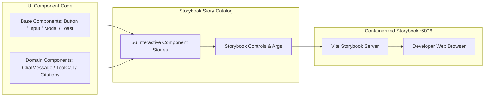

# RepoMind — Storybook UI Catalog & Workbench

## 1. Overview (In Plain Language)

Storybook is an interactive design catalog and testing workbench for RepoMind's visual components.

Think of it as a showroom where every single button, text input, modal popup, and chat bubble is displayed in all of its different modes (idle, loading, error, success) in complete isolation, without needing the backend or databases to be running.

---

## 2. Storybook Architecture Diagram




---

## 3. Containerized Storybook Service

Storybook runs as a dedicated Docker Compose service (`repomind-storybook`) on port `6006`:
- **URL**: [http://localhost:6006](http://localhost:6006)
- **Container**: `repomind-storybook`

---

## 4. Reusable Component Catalog (14 Components / 56 Stories)

### 4.1 Base Foundation Components
1. **`Button`**: Supports variants (`primary`, `secondary`, `outline`, `ghost`, `danger`), sizes (`sm`, `md`, `lg`), loading spinner states, and icon positioning.
2. **`Input`**: Text input with label, helper text, error states, and left/right icon slots.
3. **`Select`**: Custom styled dropdown selector with typed option lists.
4. **`Textarea`**: Auto-resizing multi-line text input with character limit indicators.
5. **`Badge`**: Status badge supporting `default`, `success`, `warning`, `danger`, and `info` colorways.
6. **`Modal`**: Accessible dialog overlay with backdrop blur, keyboard dismissal (Escape), and customizable action buttons.
7. **`Toast`**: Notification banners with timeout animations and dismiss controls.
8. **`Spinner`**: Animated loading spinner supporting multiple sizes and colors.

### 4.2 AI & Codebase Domain Components
9. **`ChatInput`**: Interactive multi-line message composer with submit shortcuts (Enter / Shift+Enter).
10. **`ChatMessage`**: Markdown-capable message bubble rendering user queries and assistant responses with grounded citations.
11. **`ToolCall`**: Collapsible execution card showing tool names (`search_code`, `get_file_contents`), arguments, and output status.
12. **`ExecutionStep`**: Step card displaying pipeline progress (`qdrant_retrieval`, `mcp_decision`, `llm_routing_generation`) with latency badges.
13. **`RepositorySelector`**: In-header repository picker with branch badges and indexing status pills.
14. **`SourceCitation`**: Grounded reference badge indicating file path, symbol, line bounds, and live vs. indexed provenance.

---

## 5. Verification Command
To verify that all stories compile without headless browser errors:
```bash
cd frontend
npm run build-storybook
```
