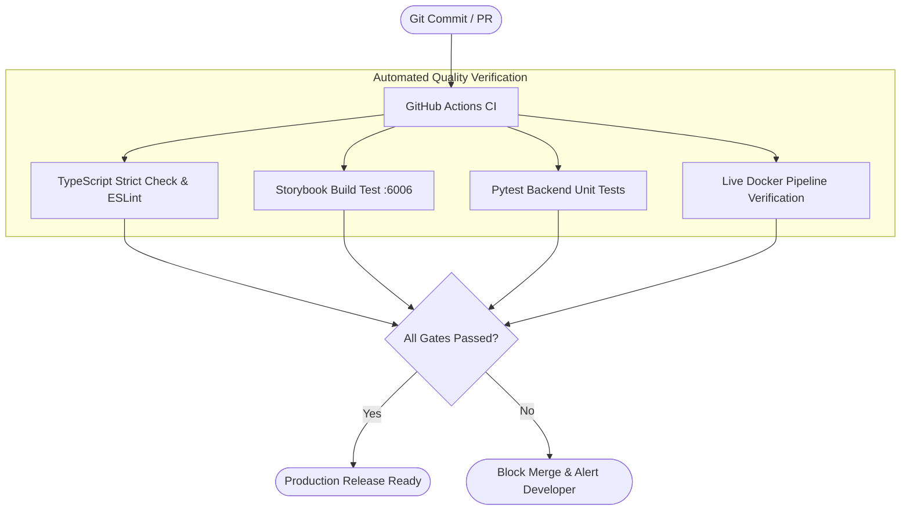

# RepoMind — Testing & Quality Assurance Specification

## 1. Overview (In Plain Language)

In RepoMind, "it compiles" is never considered proof that a feature works. 

We test software on three levels:
1. **Unit Tests**: Does this single function (like code chunking or secret redaction) behave correctly in isolation?
2. **Component Tests (Storybook)**: Does this button or chat box render properly in idle, loading, error, and success states?
3. **End-to-End Live Integration**: Does the entire 9-container system actually clone a real repository, save vectors to Qdrant, query GitHub via MCP, and return real answers with telemetry?

---

## 2. Testing Pyramid & Verification Gates




---

## 3. Test Suites Reference

### 3.1 Live Docker Integration Pipeline (`backend/tests/test_live_docker.py`)
This test exercises the entire system running inside Docker:
- Verifies health check on `GET /health`.
- Creates a repository record via `POST /api/repositories`.
- Dispatches a background indexing job via `POST /api/repositories/{id}/index`.
- Polls indexing progress via `GET /api/repositories/{id}/status`.
- Submits an AI query via `POST /api/chat`.
- Validates that Qdrant vector retrieval, MCP tools, and LLM fallback executed.
- Inspects `GET /api/executions/{id}` to verify execution telemetry.
- Verifies that TraceNest recorded structured logs in `TraceNestLogs/`.

Run with:
```bash
python backend/tests/test_live_docker.py
```

### 3.2 Backend Pytest Suite (`backend/tests/`)
Covers unit-level behavior:
- AST code chunking syntax parsing for Python, JavaScript, TypeScript, Go, Java, Rust.
- Multi-provider LLM fallback logic.
- Secret redaction and masking safety.
- Qdrant payload serialization.

Run with:
```bash
pytest backend/tests -v
```

### 3.3 Storybook Verification
Validates that all 14 reusable components build without error:
```bash
cd frontend
npm run build-storybook
```
