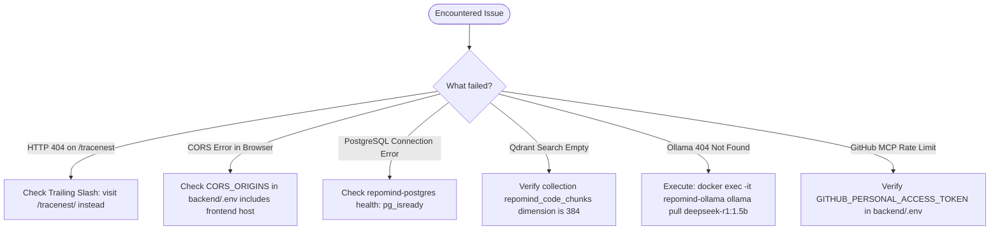

# RepoMind — Troubleshooting Guide

## 1. Overview (In Plain Language)

When developing or running a complex multi-container application, problems can occasionally occur: a service might take too long to start, a network port might be blocked, or an AI provider might be experiencing downtime.

This guide provides direct, step-by-step diagnostic procedures to quickly identify root causes and resolve issues without guesswork.

---

## 2. Interactive Troubleshooting Decision Tree




---

## 3. Common Issues & Solutions

### 3.1 TraceNest UI Returns 404 or Assets Do Not Load
- **Cause**: TraceNest assets (`styles.css`, `app.js`) are served relative to the dashboard directory.
- **Solution**:
  - Visit [http://localhost:8000/tracenest/](http://localhost:8000/tracenest/) (note the trailing slash).
  - RepoMind automatically redirects `/tracenest` to `/tracenest/` and registers root fallbacks.
  - Verify that `repomind-backend` is running and healthy.

### 3.2 Ollama Fallback Fails with 404 Not Found
- **Cause**: The local Ollama container does not have the target model downloaded yet.
- **Solution**:
  ```bash
  docker exec -it repomind-ollama ollama pull deepseek-r1:1.5b
  ```
  *Note*: RepoMind's `LocalGroundingAdapter` automatically takes over if Ollama is unconfigured or downloading.

### 3.3 Database Connection Refused (`postgresql://...`)
- **Cause**: PostgreSQL has not finished its first-time database initialization.
- **Solution**:
  ```bash
  docker compose ps postgres
  # Wait until status changes to "healthy"
  docker logs repomind-postgres
  ```

### 3.4 Browser Shows CORS Network Error
- **Cause**: The React frontend origin is not in the allowed CORS list in `backend/.env`.
- **Solution**:
  Ensure `CORS_ORIGINS` in `backend/.env` includes your browser URL:
  ```env
  CORS_ORIGINS=http://localhost:3000,http://127.0.0.1:3000
  ```
